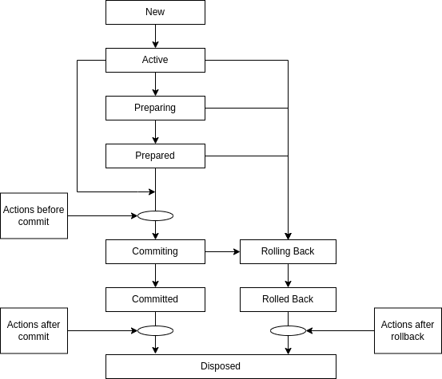
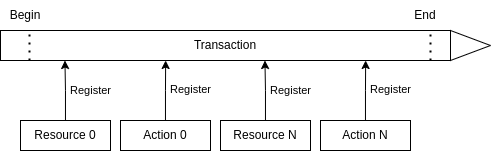

.. _ecos-transactions:

Транзакции
==========

В Citeck реализованы транзакции на базе двухфазного коммита.

Описание сущностей:

 1. **Транзакционный ресурс** — ресурс, который поддерживает работу с транзакциями (например, база данных);
 2. **Транзакционное действие** — действие, которое привязывается к жизненному циклу транзакции и выполняется в одном из трёх случаев: перед коммитом, после коммита, после отката транзакции;
 3. **Транзакция** — сущность, в рамках которой можно регистрировать транзакционные ресурсы и действия. Если в ходе транзакции происходит ошибка, то транзакция откатывается и система возвращается к состоянию до начала транзакции;
 4. **Транзакционный менеджер** — менеджер, который управляет транзакциями.

Жизненный цикл транзакции:

Общая схема работы:

Описание работы:

1. Транзакция начинается.
2. В ходе работы идёт работа с ресурсами, которые регистрируются в транзакции.
3. Также в ходе работы возникают действия, которые нужно выполнить перед коммитом, после коммита или после отката транзакции.
4. Перед коммитом выполняются все транзакционные действия, зарегистрированные в транзакции.
5. Перед коммитом проверяется количество ресурсов. Если ресурс один, выполняется однофазный коммит. Если ресурсов несколько, выполняется подготовка к коммиту и коммит подготовленной транзакции.
6. После коммита выполняются все транзакционные действия, зарегистрированные в транзакции.
7. Если что-то пошло не так в ходе транзакции, все ресурсы откатываются к исходному состоянию и выполняются действия после отката, которые успели зарегистрироваться в ходе транзакции.

Работа с транзакциями в Kotlin-коде:

.. code-block:: kotlin

    val result = TxnContext.doInTxn {
        "выполняем нужные действия и возвращаем результат"
    }

Работа с транзакциями в Java-коде:

.. code-block:: java

    String result = TxnContext.doInTxnJ(() -> {
        return "выполняем нужные действия и возвращаем результат";
    });

Данные методы создают транзакцию, если её нет, или используют существующую. Если требуется принудительно выполнить действие в новой транзакции, следует использовать методы ``doInNewTxn`` и ``doInNewTxnJ`` соответственно.

Для Records API транзакции запускаются автоматически в момент, когда приходит запрос извне приложения.
