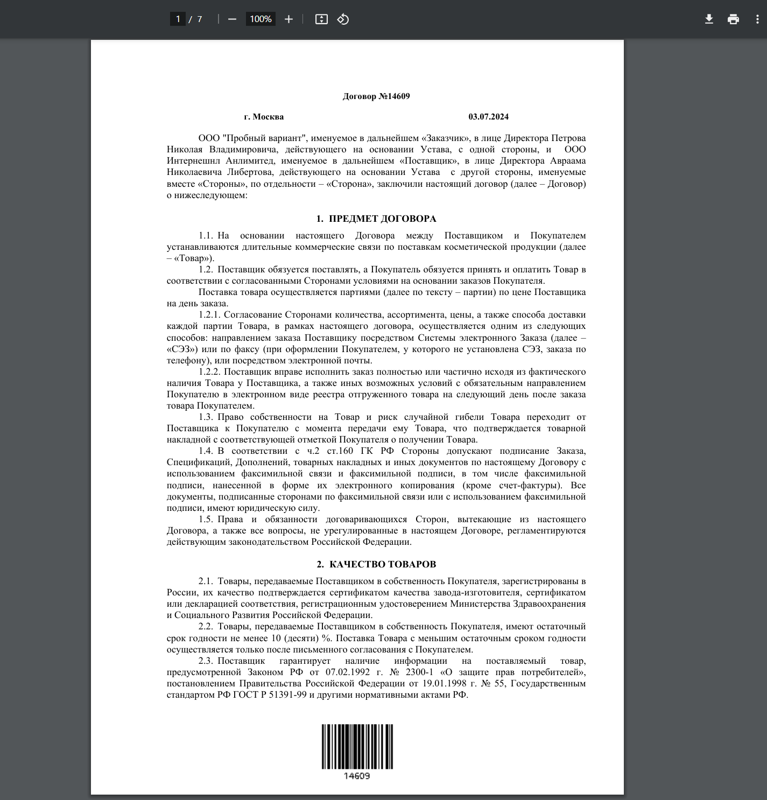
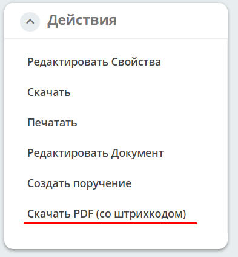

.. _barcode:

Штрих-код
==================

.. note::

   Доступно только в Enterprise версии.

Citeck позволяет автоматически формировать PDF-документ со встроенным штрих-кодом — это упрощает идентификацию и отслеживание документов в рамках бизнес-процессов. Функционал реализован с использованием микросервиса :ref:`ecos-transformations <transformation>` и инструмента PDFStamp.

На основе атрибута записи генерируется изображение штрих-кода, которое можно:

1. Отобразить в карточке;
2. Открыть для печати;
3. Наложить на PDF-документ.

Процесс формирования PDF-документа со штрих-кодом:

1. Конвертация в PDF из файлов **doc** и **docx**, прикреплённых к карточке.
2. Контент заполняется путём вложения пользователем документа или генерируется из :ref:`шаблона (FreeMarkerTemplate) <doc_template>`.
3. После генерации PDF-файл прикрепляется в виджет документов карточки или в контент дочерней сущности.
4. Штрих-код размещается внизу документа:

Настройка штрих-кода
-----------------------------------------

Настройка осуществляется через :ref:`аспект <aspects>`, который добавляется к требуемому типу:

Аспект: **Имеет штрих-код (barcode)**

В настройках аспекта для типа есть 2 поля:

1. Формат штрих-кода (format)
2. Атрибут с содержимым для штрих-кода (attribute)

Добавление штрих-кода в PDF-документ
------------------------------------------------

Для добавления штрих-кода в PDF можно воспользоваться возможностями :ref:`трансформации содержимого <content_transformation>`.

Конфигурация действия (наложение штрих-кода на уже существующий PDF):

.. code-block:: yaml

   ---
   id: download-with-barcode
   name: Скачать с штрих-кодом
   type: transform
   config:
     transformations:
       - type: barcode

Если содержимое документа нужно предварительно конвертировать в PDF (например, из **doc**/**docx**), добавьте трансформер ``convert`` перед ``barcode``:

.. code-block:: yaml

   ---
   id: download-with-barcode-converted
   name: Скачать PDF со штрих-кодом
   type: transform
   config:
     transformations:
       - type: convert
         config:
           toMimeType: application/pdf
       - type: barcode

Для скачивания документа с наложенным штрих-кодом используйте в карточке действие **Скачать PDF (со штрих-кодом)**:

Подробнее о трансформациях — в :ref:`трансформации содержимого <content_transformation>`.

Rest API
----------

Для загрузки штрих-кода в виде изображения можно воспользоваться следующим API:

``GET /gateway/transformations/api/barcode/image?content=123``

Параметры:

.. code-block:: text

   barcodeFormat: String? // формат штрих-кода. По умолчанию CODE_128
   imageFormat: String?   // формат изображения. По умолчанию PNG
   width: Int?            // ширина изображения
   height: Int?           // высота изображения
   margin: Int?           // отступ от краёв
   altText: Boolean?      // рендерить текстовое содержимое штрих-кода. По умолчанию — Да
   content: String?       // содержимое штрих-кода. Если задано, то entityRef и attribute игнорируются
   entityRef: String?     // сущность, из которой нужно загрузить содержимое для штрих-кода
   attribute: String?     // атрибут сущности, из которого нужно загрузить содержимое для штрих-кода
   download: Boolean?     // если true — изображение скачивается; если false — открывается в браузере
   print: Boolean?        // если true — пользователю отправляется PDF со штрих-кодом для печати
   outputType: String?    // формат результата. По умолчанию PDF (если print=true) или изображение.
                          // Значение "json" — содержимое возвращается в виде JSON с полем data (base64)

Поддерживаемые форматы штрих-кода:

- AZTEC
- CODABAR
- CODE_39
- CODE_93
- CODE_128
- DATA_MATRIX
- EAN_8
- EAN_13
- ITF
- PDF_417
- QR_CODE
- UPC_A
- UPC_E
