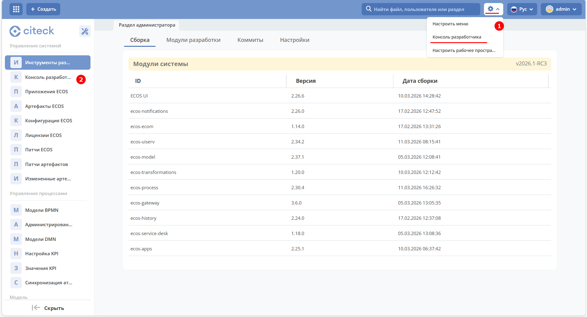

.. _developer_console:

Консоль разработчика
=======================

Консоль разработчика для администраторов позволяет выполнять **JavaScript код** непосредственно в браузере с отображением результатов.

Вызвать консоль можно из рабочего пространства "Раздел администратора" в верхнем правом углу через шестеренку.

В панель инструментов консоли разработчика добавлена кнопка **AI-ассистента**  — позволяет использовать AI для генерации и редактирования кода прямо в консоли.

Панель управления переработана: вместо крупных кнопок с текстом используется компактный тулбар с иконками и тултипами (Run, Undo, Redo, Save, переключение расположения панели).

Добавлено подтверждение удаления сниппета — при нажатии кнопки «Удалить» открывается модальное окно с запросом подтверждения.

Реализовано обновление существующего сниппета: если при сохранении название совпадает с активным сниппетом, код обновляется, а не создаётся дублирующая запись. В модальном окне отображается подсказка «Существующий сниппет будет обновлён».

Добавлена возможность запуска кода по hotkey shilft+enter