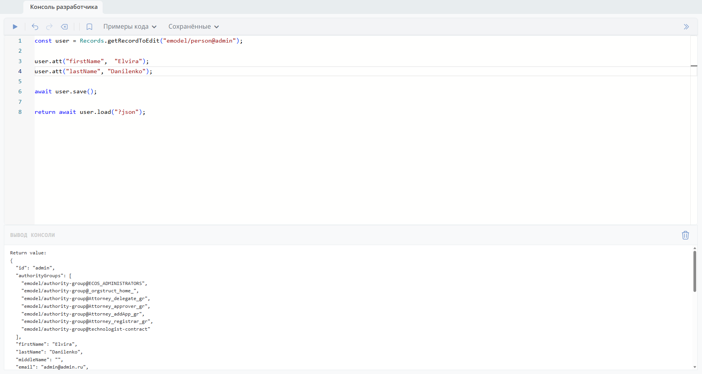
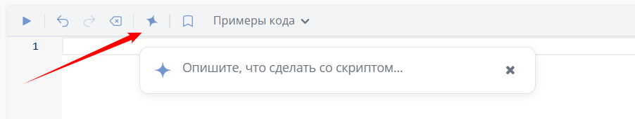
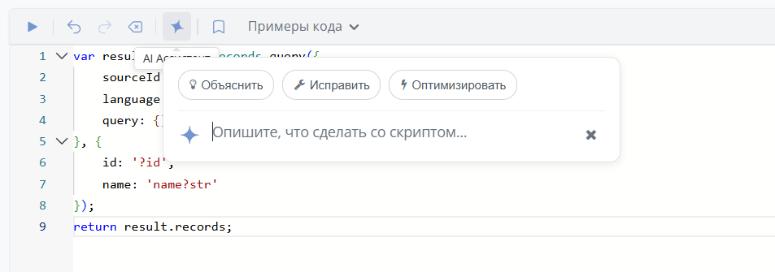

.. _developer_console:

Консоль разработчика
=======================

Консоль разработчика для администраторов позволяет выполнять **JavaScript код** непосредственно в браузере с отображением результатов.

Вызвать консоль можно из рабочего пространства "Раздел администратора" в верхнем правом углу через шестеренку **(1)** или через соответствующий пункт меню **(2)**:

.. image:: _static/console/01.png
    :width: 800
    :align: center

Общий вид панели консоли разработчика:

- Вверху **панель инструментов** с кнопками управления (**Выполнить, Отменить, Повторить, Очистить, Сохранить код**), выпадающие меню **«Примеры кода»** и **«Сохранённые»**, переключение расположения панели.
- Основная область — **редактор кода** с нумерацией строк и синтаксической подсветкой.
- Внизу секция **«Вывод консоли»**.

Код можно запустить и по сочетанию клавиш **Shift + Enter**.

Работа со сниппетами
---------------------

**Сниппет** — готовый фрагмент кода, который можно вставить одним кликом, чтобы не писать с нуля.

Сниппет можно сохранить - нажать кнопку **«Сохранить код»**, ввести название сниппета. Сохранённые сниппеты отображаются в выпадающем меню **«Сохранённые»** и доступны для быстрой вставки.

Если при сохранении название совпадает с активным сниппетом - код обновляется. В модальном окне отобразится подсказка **«Существующий сниппет будет обновлён»**.

При удалении сниппета из меню **«Сохранённые»** появится модальное окно с запросом подтверждения удаления. В случае подтверждения сниппет будет удалён.

Кнопка **AI-ассистент**
-------------------------

.. note::

 Доступно только в enterprise версии.

В панель инструментов консоли разработчика добавлена кнопка :ref:`AI-ассистента <AI_assistant>` — позволяет использовать AI для генерации и редактирования кода прямо в консоли.

Например, можно попросить AI-ассистента написать код для получения списка всех пользователей:

.. list-table:: 
      :widths: 20 20

      * - | 

            .. image:: _static/console/04.png
                 :width: 400   

        - | 

             .. image:: _static/console/05.png
                  :width: 700   

Если в редакторе уже есть код, то при запросе к AI-ассистенту появятся подсказки:

