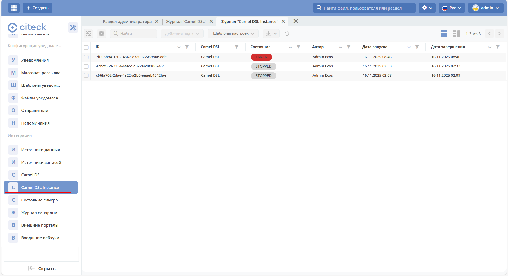

.. _camel_instance:

Инстансы контекста Camel DSL
=============================================

Журнал содержит информацию о запущенных отдельных инстансах Camel контекста импорта данных.

Журнал доступен по адресу: ``v2/journals?journalId=ecos-camel-dsl&viewMode=table&ws=admin$workspace``

Подробная информация об инстансе:

.. image:: _static/instances/instance_02.png
   :width: 600
   :align: center

Возможные состояния Camel DSL Instance:

- **RUNNING** — контекст запущен и выполняется работа
- **STOPPED** — контекст успешно выполнил работу и завершён
- **ERROR** — во время выполнения произошла ошибка, контекст остановлен
