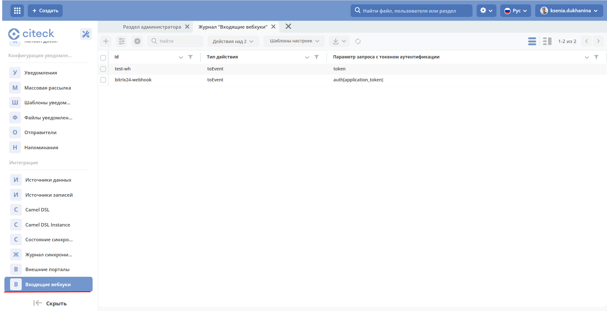

.. _webhooks:

Вебхуки
========

.. contents::
   :depth: 3

**Вебхук (webhook)** — механизм интеграции, при котором внешняя система отправляет HTTP-запрос в Citeck при наступлении определённого события. В отличие от опроса (polling), вебхук работает по принципу «push»: данные поступают сразу в момент события, без необходимости периодически запрашивать их.

Citeck поддерживает **входящие вебхуки**: внешняя система отправляет POST-запрос на специальный endpoint, Citeck проверяет токен и публикует событие во внутреннюю шину. Далее событие может быть обработано любым подписчиком — BPMN-процессом, интеграционным маршрутом Camel DSL и т.д.

Типичный сценарий использования:

- внешняя CRM (например, Bitrix24) уведомляет Citeck о создании новой сделки;
- мессенджер или CI/CD-система отправляет событие по завершении задачи;
- любая сторонняя система инициирует запуск бизнес-процесса в Citeck.

Настройки доступны в журнале **«Входящие вебхуки»** (Рабочее пространство «Раздел администратора» — Интеграция).

Журнал доступен по адресу: ``v2/journals?journalId=in-webhook-journal&viewMode=table&ws=admin$workspace``

Расположение артефактов с данным типом: **integration/in-webhook**

Форма создания
---------------

.. image:: _static/webhooks/webhook_02.png
   :width: 600
   :align: center

Атрибуты (in-webhook):

.. list-table::
   :widths: 5 5 10
   :align: center
   :header-rows: 1
   :class: tight-table

   * - Атрибут
     - Тип
     - Описание
   * - id
     - Текст
     - Идентификатор, используется для формирования endpoint вебхука
   * - token
     - ASSOC (secret)
     - | :ref:`Секрет <ECOS_secrets>` с типом «Токен».
       | Необходим для проверки валидности запроса.
   * - actionType
     - Текст
     - Тип действия при обработке запроса
   * - authParameter
     - Текст
     - | Параметр запроса, в котором передаётся токен.
       | Если не задан, используется значение по умолчанию: **token**

Пример конфигурации:

.. code-block:: yaml

    ---
    id: bitrix24-webhook
    token: emodel/secret@bitrix24-webhook-token
    actionType: toEvent
    authParameter: auth[application_token]

После создания входящего вебхука становится доступна отправка POST-запросов по адресу:

.. code-block:: text

    http://host/gateway/integrations/pub/webhook/${id}

где **id** — идентификатор, указанный при создании вебхука.

В запросе обязательно должно присутствовать **тело (body)**.

Токен для аутентификации должен передаваться в параметре, указанном при создании вебхука.

Например:

.. code-block:: text

    http://host/gateway/integrations/pub/webhook/bitrix24-webhook?token=testAuthToken

На данный момент доступен один тип действия — «Трансформация в Events». При обработке вебхука проверяется токен.

Если проверка прошла успешно, создаётся :ref:`ECOS Event <ecos_events>` в стандартную очередь **ecos-events** с типом **in-webhook-request**. Event содержит данные запроса:

.. code-block:: text

    webhookId: String
    params: Map<String, String>
    body: String

Например:

.. code-block:: json

    {
      "params": {"event":"ONCRMDEALADD","auth[application_token]":"123","data[FIELDS][ID]":"9"},
      "body":"event=ONCRMDEALADD&auth%5Bapplication_token%5D=123&data%5BFIELDS%5D%5BID%5D=9",
      "webhookId":"bitrix24-webhook"
    }

Доступ на чтение и редактирование вебхуков есть только у Администратора и Системы.

Ошибки
-------

При отправке запроса на вебхук возможны следующие ошибки:

.. list-table::
   :widths: 5 10 10
   :align: center
   :header-rows: 1
   :class: tight-table

   * - Код
     - Детали
     - Комментарий
   * - 500
     - Invalid webhook id={wh_id}
     - Вебхук с указанным id не найден
   * - 500
     - Secret ${webhook.token} not found
     - Секрет, заданный в вебхуке, не найден
   * - 500
     - Authentication token is not valid
     - Параметр с токеном отсутствует в запросе или токен неверный
   * - 500
     - Not found action type ${webhook.actionType}
     - Указан несуществующий тип действия

Вебхук используется, например, для :ref:`синхронизации с Bitrix24 <bitrix24_crm>`.
