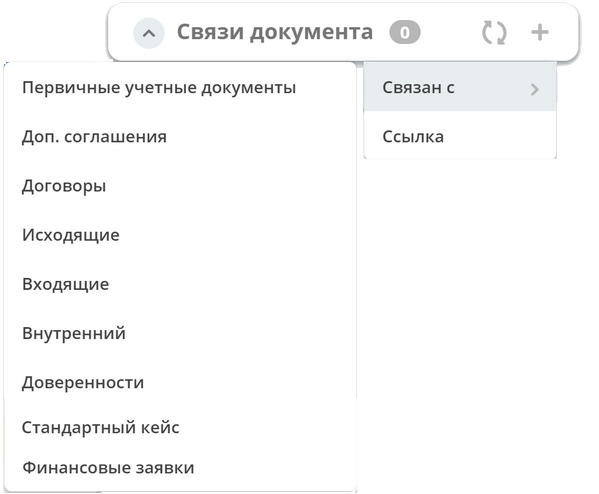
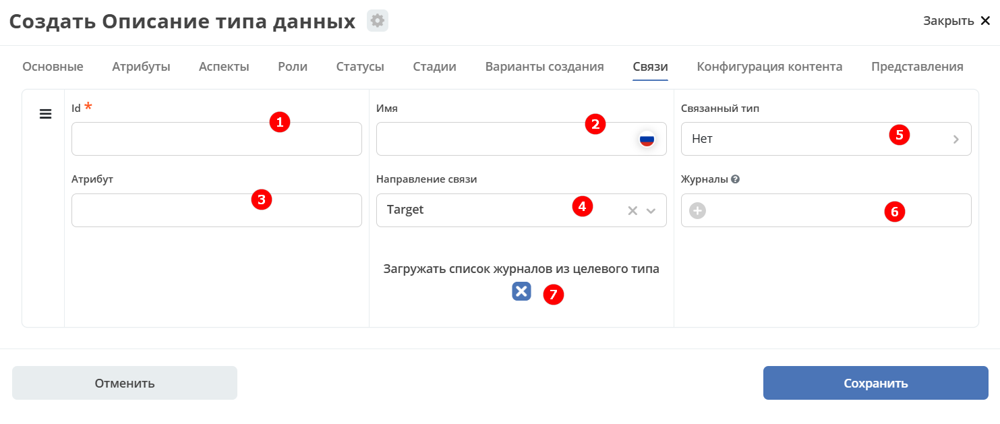
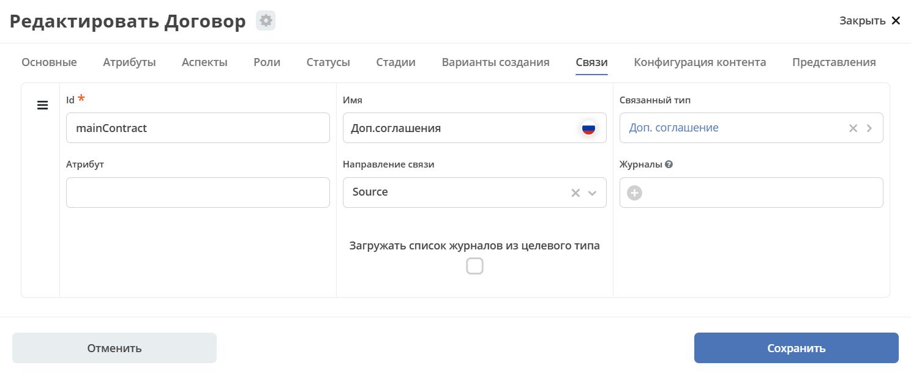
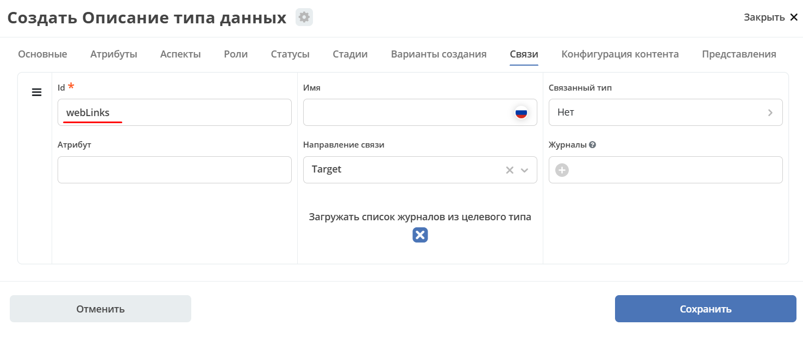
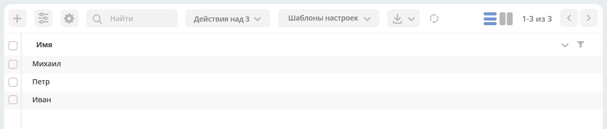
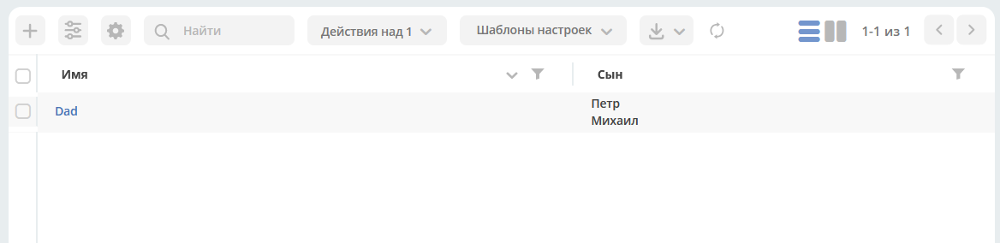

.. _data_types_associations_tab:
.. _datatypes_associations:

Связи
======

**Связи (associations)** настраиваются для отображения, добавления и удаления связанных объектов в виджете формы :ref:`«Связи документов» <widget_doc_associations>` на карточке объекта.

.. list-table::
      :widths: 10 30 30
      :header-rows: 1
      :align: center
      :class: tight-table

      * - п/п
        - Наименование
        - Описание
      * - 1
        - **Id**
        - | идентификатор связи. Обязательное поле (если не заполнено, то сервер такую связь не сохраняет).
          | Это поле нужно для:
          | 1. Перезаписывания конфигурации связи в дочернем типе. Т.е. если мы в дочернем типе укажем тот же ID, то по сути перезатрем конфигурацию связи
          | 2. Указания атрибута, в котором связь сохранится (если не задано значение в поле "Атрибут")
      * - 2
        - **Имя**
        - имя связи для отображения в интерфейсе
      * - 3
        - **Атрибут**
        -  | в который новые связи будут добавляться и из которого будут загружаться.
           | Как правило это ассоциация из вкладки :guilabel:`Атрибуты`. Если не задано то используется значение поля ID.
      * - 4
        - **Направление связи**
        - | определяет какие связи отображать в виджете связей. Любая связь строится по принципу **SOURCE -> TARGET**
          |
          | - **SOURCE** - обратная к **TARGET** связь у источника. При открытии карточки **TARGET** мы увидим нашу связь. При открытии карточки **SOURCE** мы ничего не увидим.
          |
          | - **TARGET** - связь отображается только у документа, который хотим привязать. При открытии карточки **TARGET** мы ничего не увидим. При открытии карточки **SOURCE** мы увидим нашу связь.
          |
          | - **BOTH** - двухсторонняя связь. И на карточке **SOURCE** и на карточке **TARGET** увидим нашу связь.
      * - 5
        - **Связанный тип**
        - тип сущностей, с которыми мы можем связать наш документ.
      * - 6
        - **Журналы**
        - список журналов, которые можно использовать для создания новой связи. Если необходимо создавать связи не с одним определенным типом.
      * - 7
        - **Загружать список журналов из целевого типа**
        - | загрузка списка журналов из типа данных.
          | Возможные значения — null, true, false.

Пример:

Связь документа с простой ссылкой
-----------------------------------

Для добавления возможности связать документ с простой ссылкой (**Id** - webLinks, **Направление связи** - Target):

.. _associations_both_sides:

Связь в обе стороны
--------------------

Для связи в обе стороны необходимо, чтобы у источника ассоциации и у цели ассоциации была настроена ассоциация в типе с одним ID.

.. list-table::
      :widths: 20 20
      :align: center

      * - |

            .. image:: _static/both_link_1.png
                  :width: 500
                  :align: center

        - |

            .. image:: _static/both_link_2.png
                  :width: 500
                  :align: center

Простой пример настройки связей
---------------------------------

1. Создадим 2 типа данных:

- **Sons**:

.. list-table::
      :widths: 30 30
      :align: center
      :class: tight-table

      * -

          .. image:: _static/Sample/r_01.png
                :width: 600
                :align: center

        -

          .. image:: _static/Sample/r_02.png
                :width: 600
                :align: center

- **Dad**:

.. list-table::
      :widths: 30 30
      :align: center
      :class: tight-table

      * -

          .. image:: _static/Sample/r_03.png
                :width: 600
                :align: center

        -

          .. image:: _static/Sample/r_04.png
                :width: 600
                :align: center

          | **Son** зададим ассоциацией:

          .. image:: _static/Sample/r_05.png
                :width: 300
                :align: center

2. Заполним журнал **Sons** элементами:

3. Заполним **Dad** - добавим к нему **sons**:

**Случай 1.** Чтобы **у Dad в виджете «Связи» отображались Sons.** Для этого необходимо:

1. Перейти в тип данных **Dad** во вкладку **«Связи»**, настроить:

        .. image:: _static/Sample/r_08.png
              :width: 600
              :align: center

  1. **Идентификатор связи.**
  2. **Наименование связи**, которое будет использоваться в виджете.
  3. **Атрибут**, в который новые связи будут добавляться и из которого будут загружаться.
  4. **Направление связи.** **Source** является **Dad**, **target**, соответственно, **Sons**.
  5. **Тип данных.** Для добавления элементов в виджете по нажатию **+**, и правильного отображения столбцов в нем.

2. Перейти в журнал **Dad**, открыть карточку:

        .. image:: _static/Sample/r_09.png
              :width: 700
              :align: center

        |

        .. image:: _static/Sample/r_10.png
              :width: 600
              :align: center

**Случай 2.** Чтобы **у каждого Son в виджете «Связи» отображался его Dad.** Для этого необходимо:

1. Перейти в тип данных **Sons** во вкладку **«Связи»**, настроить:

        .. image:: _static/Sample/r_11.png
              :width: 600
              :align: center

  1. **Идентификатор связи.**
  2. **Наименование связи**, которое будет использоваться в виджете.
  3. **Атрибут**, в который новые связи будут добавляться и из которого будут загружаться.
  4. **Направление связи.** **Source** является **Son**, **target**, соответственно, **Dad**.
  5. **Тип данных.** Для добавления элементов в виджете по нажатию **+**, и правильного отображения столбцов в нем.

2. Перейти в журнал **Sons**, открыть карточку:

        .. image:: _static/Sample/r_12.png
              :width: 600
              :align: center
