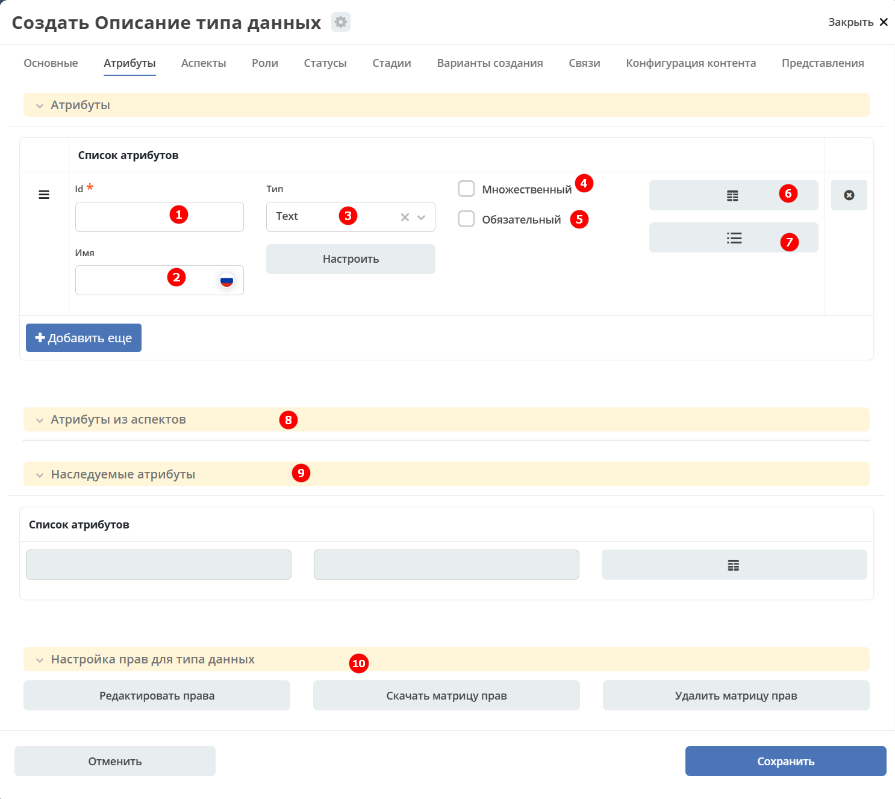
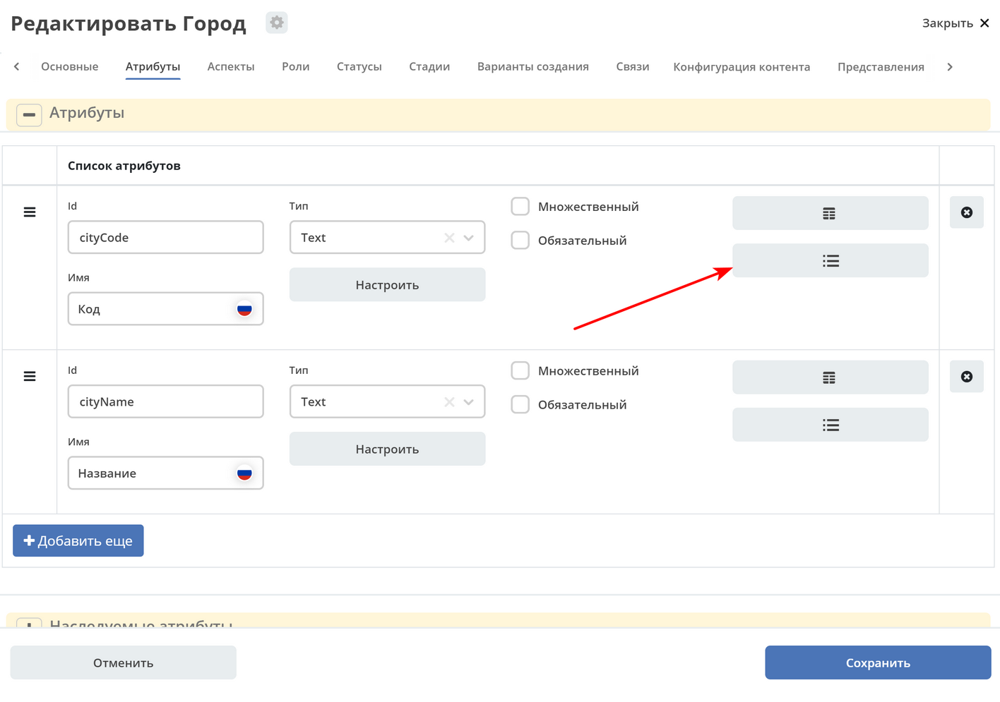
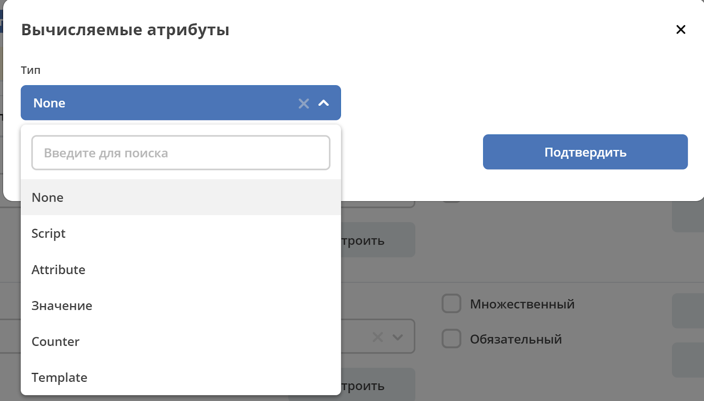
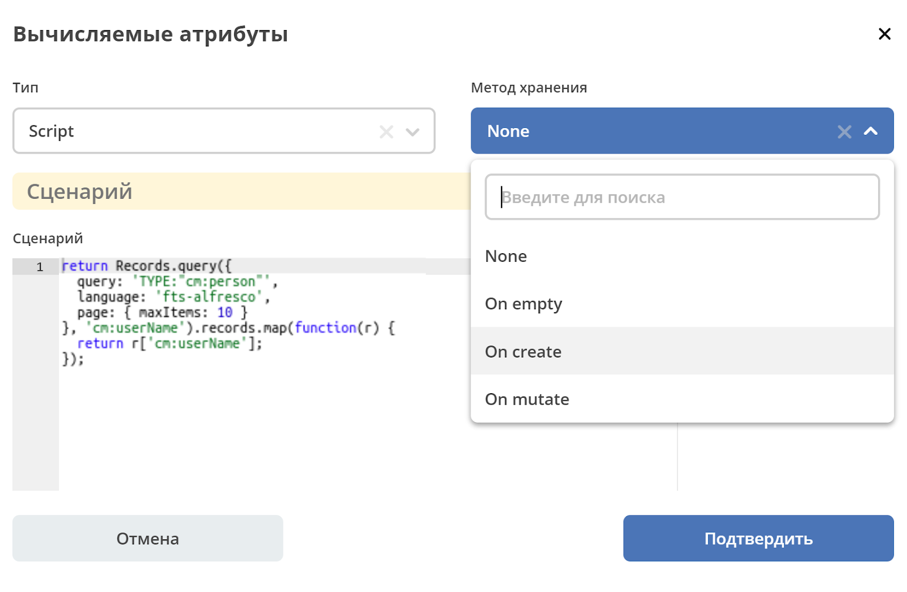
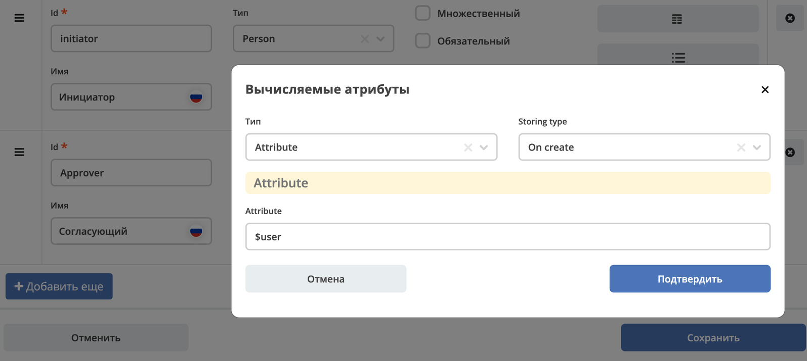
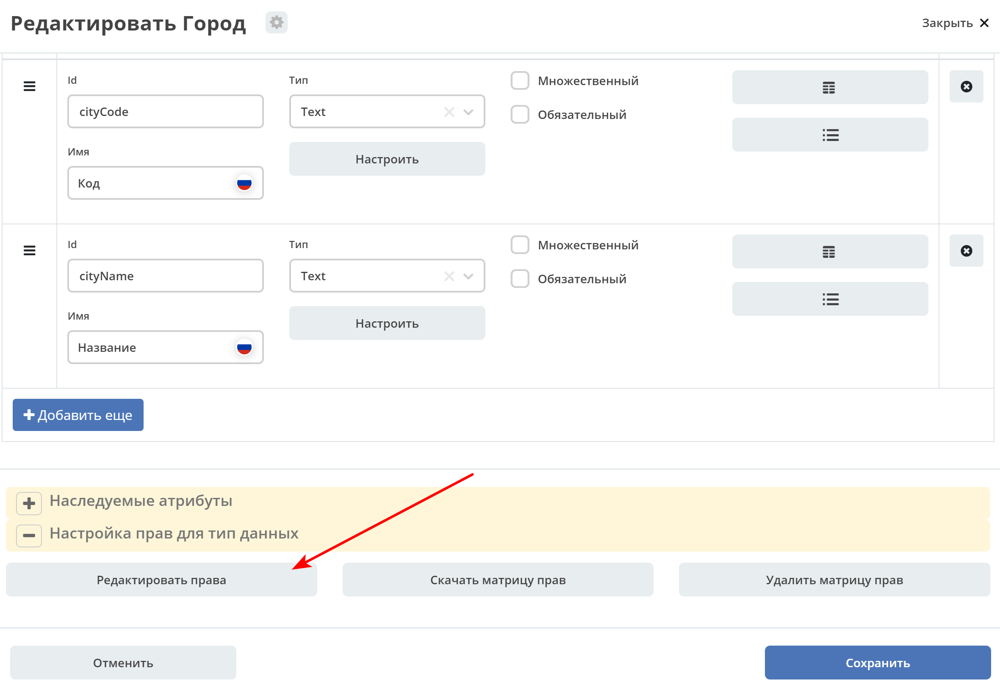
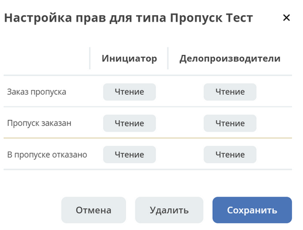
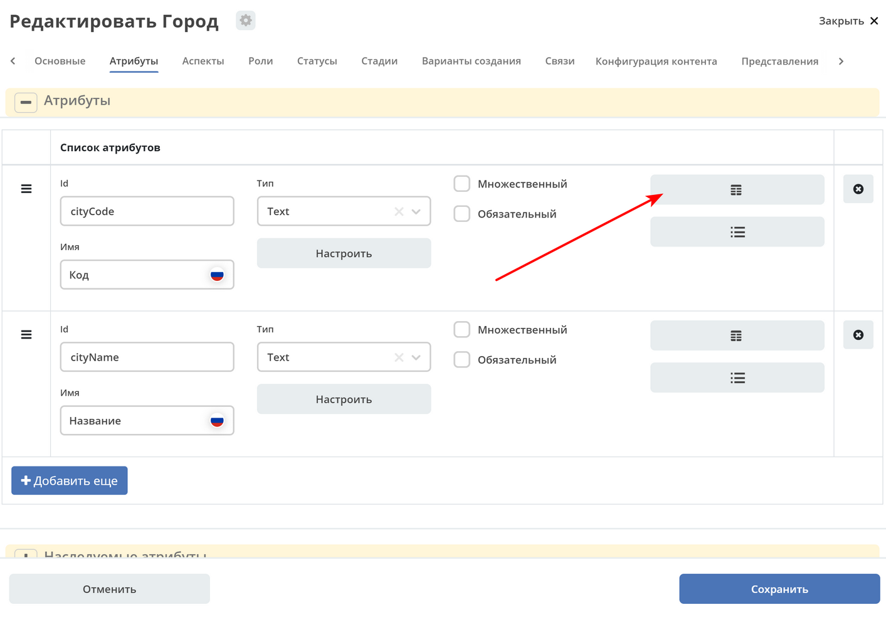
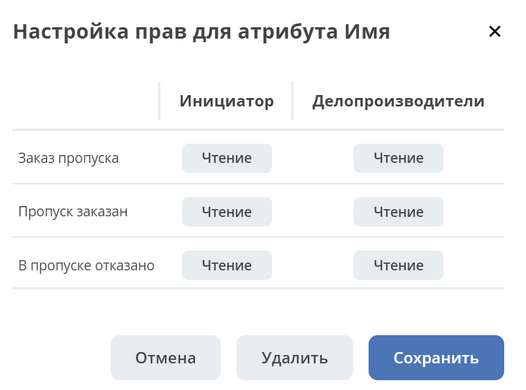
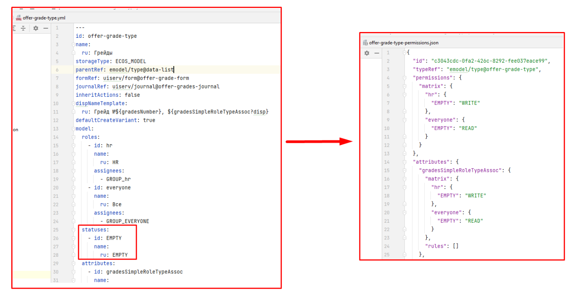

.. _ecos-model_label:

Атрибуты
==========

Вкладка **«Атрибуты»** в настройках типа данных определяет структуру данных объекта: поля, их типы и поведение.

**Атрибут** — это именованное поле типа данных, в котором хранится конкретная единица информации об объекте (например, наименование, дата, связанный контрагент). Атрибуты используются в формах, журналах, бизнес-процессах и при настройке прав доступа.

На вкладке можно:

- задать набор полей типа данных с их идентификаторами и типами;
- отметить поля как обязательные или допускающие множественный ввод;
- настроить вычисляемые атрибуты, значения которых определяются по заданному выражению;
- управлять матрицей прав доступа на уровне документа и отдельных атрибутов.

.. list-table::
      :widths: 10 30 30 30
      :header-rows: 1
      :align: center
      :class: tight-table

      * - п/п
        - Наименование
        - Описание
        - Пример заполнения
      * - 1
        - **Id**
        - идентификатор поля, по которому оно будет доступно на форме, в журнале.
        - testAttribute (camelCase)
      * - 2
        - **Имя**
        - имя поля для отображения пользователю.
        - Тестовый атрибут
      * - 3
        - **Тип**
        - тип поля. :ref:`Поддерживаемые типы<ecos-model_types>`
        - выбирается из списка предлагаемых. По умолчанию выставляется text.
      * - 4
        - **Множественный**
        - множественный ввод разрешен
        - флаг
      * - 5
        - **Обязательный**
        - поле обязательно к заполнению
        - флаг
      * - 6
        - **Настройка прав для атрибута**
        - функционал, позволяющий произвести настройку прав доступа в отношении "Роль-Статус" для конкретного атрибута. :ref:`См. подробно<attribute_rights>`
        - выбирается состояние доступа атрибута на пересечении сетки "Роль-Статус"
      * - 7
        - **Вычисляемые атрибуты**
        - функционал, позволяющий установить выражение-зависимость для гибкого создания производных атрибутов :ref:`См. подробно<count_attributes>`
        - настройка конфигурации в зависимости от типа и сложности вычисления атрибута
      * - 8
        - **Атрибуты из аспектов**
        - TBD
        - отсутствует
      * - 9
        - **Наследуемые атрибуты**
        - отображение значений наследуемых от родительского типа атрибутов в соответствии с п. 1, 2 и 6 (при условии что родительский тип задан и имеет атрибуты)
        - отсутствует
      * - 10
        - **Настройка прав для типа данных**
        - | функционал, позволяющий произвести настройку прав доступа документа в отношении "Роль-Статус".
          | А также выгрузить и удалить полную схему прав (включая настройки из п.6) :ref:`См. подробно<doc_rights>`
        - выбирается состояние доступа документа на пересечении сетки "Роль-Статус"

Возможные типы атрибутов
-------------------------

.. _ecos-model_types:

.. list-table::
      :widths: 10 20
      :align: center
      :class: tight-table

      * - **Text**
        - | Текст
          | По кнопке **"Настроить"** выбрать, текстовый атрибут является Уникальным.
          | При этом добавляется проверка уникальности таких атрибутов при создании и редактировании записей.
          | При приватной видимости уникальность проверяется для каждого созданного рабочего пространства, при публичной видимости - для всех созданных рабочих пространств.

          .. image:: _static/text_unique.png
                :width: 400
                :align: center

      * - **Options**
        - | Возможность настраивать ограничения на атрибуты в виде списка возможных значений.
          | По кнопке **"Настроить"** можно настроить варианты для выбора с их отображаемым именем:

          .. image:: _static/options_type.png
                :width: 400
                :align: center

          | Этот тип атрибута учтен при генерации авто-формы (на форме будет ecosSelect с вариантами, которые настроены в атрибуте) и в авто-журнале (фильтр будет выпадающим списком).
          | На бэкенде добавлена проверка значения у таких атрибутов, и если пользователь пытается записать значение, которое отсутствует в списке, то будет выдана ошибка.

      * - **MLText**
        - Текст с локализацией. Содержание меняется в зависимости от выбранной локализации.
      * - **Person**
        - Пользователь из оргструктуры
      * - **Group**
        - Группа пользователей из оргструктуры
      * - **Authority**
        - Пользователь или группа. Это по сути базовый тип и для пользователей и для групп
      * - **Association**
        - | Связь с другой сущностью.
          | По кнопке **"Настроить"** выбрать тип данных и при необходимости выставить признак дочерней ассоциации:

          .. image:: _static/association_type.png
                :width: 400
                :align: center

          | У дочерней сущности автоматически появляется ассоциация ``_parent``
          | При проверке прав если для текущей сущности нет специфичных настроек прав, то проверяются родительские.
          | При удалении родителя так же удаляются все связанные сущности.
          | Для дочерних ассоциаций есть защита от цикличной зависимости.
          |
          | Таким образом образуется двухсторонняя связь:
          | - от дочернего к родителю по системному атрибуту ``_parent``,
          | - от родителя к дочернему по настроенному атрибуту.

      * - **Number**
        - Число
      * - **Boolean**
        - Булево значение да/нет
      * - **Date**
        - Дата
      * - **DateTime**
        - Дата и время
      * - **Content**
        - Содержимое. Как правило поля с этим типом используются для сохранения больших объемов данных. Например - содержимое документа.
      * - **JSON**
        - Текстовый, структурированный формат данных. Например:

          .. code-block:: json

            {"some": "data"}
      * - **Binary**
        - | Массив байт. Похож на контент, но намного проще.
          | Не рекомендуется здесь хранить более 1мб данных.

Вычисляемые атрибуты
---------------------

.. _count_attributes:

|

**Тип** - тип вычисляемого атрибута. Поддерживаются:

    * **Script** - вычисление атрибута на основе ``javascript'а``;
    * **Attribute** - вычисление атрибута на основе другого атрибута (можно делать алиас на глубоко вложенный атрибут. Например: ``counterparty.idocs:fullOrganizationName?str``);
    * **Значение** - константное значение;
    * **Counter** - значение будет генерироваться по счетчику при создании документа и не меняться со временем.
    * **Template** - шаблонная строка. Можно использовать вставки вида ${…}. Например: ``${someAttribute?str}``. Вместо данного плейсхолдера будет подставлено значение указанного атрибута;

**Метод хранения** - тип сохранения. Определяет, нужно или нет сохранять вычисленное значение и если да, то в какие моменты. Возможные значения:

    * **None** - сохранение не нужно. При каждом обращении вычисляем значение заново;
    * **On empty** - сохранять вычисленное значение только если сохраненное значение отсутствует (т.е. при запросе значения вернулся ``null``);
    * **On create** - сохранять вычисленное значение только после создания. Последующие мутации никак данный атрибут не затронут и он будет работать как обычный атрибут.
    * **On mutate** - сохранять вычисленное значение при каждой мутации. В случае использования :ref:`Records API<Records_API>` для изменения записи гарантируется актуальность значения.

Возможности атрибута с типом **script**
~~~~~~~~~~~~~~~~~~~~~~~~~~~~~~~~~~~~~~~~

Объекты в глобальной области видимости:

.. list-table::
      :widths: 10 20
      :align: center
      :class: tight-table

      * - **Records** - адаптер для RecordsService;
        - Методы:

            .. code-block:: text

              get(recordRef: String): AttValueScriptCtx // возвращает объект аналогичный value, который описан выше
              query(query: Object, attributes: Any?) // возвращает объект вида:

            .. code-block:: json

              {
                  "records": [{
                          "id": "emodel/person@ivan.petrov",
                          "attribute0": "value0",
                          "attribute1": "value1"
                      }, {
                          "id": "emodel/person@petr.ivanov",
                          "attribute00": "value00",
                          "attribute11": "value11"
                      }
                  ],
                  "totalCount": 123,
                  "hasMore": true
              }

      * - **value** - текущий документ;
        - |  Свойства

            .. code-block:: text

                id: String //глобальный идентификатор записи
                localId: String //локальный идентификатор записи

          | Методы:

            .. code-block:: text

              load(attributes: Any?): Any? // загрузка атрибутов у текущей записи. Можно передавать массив, строку и объект <String, String>

          | Пример:
          | Вычислить атрибут на основе трех других:

            .. code-block::

              var firstName = value.load('firstName');
              var lastName = value.load('lastName');
              return lastName + ' ' + firstName;

      * - **log** - логгер.
        - [уточнить]

.. warning:: Прикладных сервисов в контексте скрипта нет.

Примеры
""""""""

Заполнение инициатора (initiator) текущим пользователем:

Матрица прав
-------------

.. _permissions:

**Матрица прав** - таблица, которая показывает, какими правами обладает конкретная роль на отдельные виды данных.

Права могут быть настроены отдельно на документ, отдельно на его атрибуты.

Матрицы, созданные для типов данных хранятся в :ref:`журнале Матрицы<permissions_journal>`.

Настройка прав
~~~~~~~~~~~~~~~

Настройка прав осуществляется на форме редактирования типа во вкладке :guilabel:`Атрибуты`.

.. _doc_rights:

Права на документ:

|

.. important::

  Чтобы сформированные по умолчанию права на документ вступили в силу, нажмите **Сохранить**

.. _attribute_rights:

Права на атрибут:

|

.. important::

  Чтобы сформированные по умолчанию права на атрибут вступили в силу, нажмите **Сохранить**

.. important::

  Если пользователь участвует одновременно в нескольких ролях, то получает наибольшие права из тех, что ему доступны согласно матрице.

.. important::

  При разработке модуля необходимо по соответствующей кнопке скачать матрицу прав. Полученный json поместить в модель по пути: ``app/artifacts/model/permissions``

Настройка прав на атрибуты в зависимости от каких-либо алгоритмов
~~~~~~~~~~~~~~~~~~~~~~~~~~~~~~~~~~~~~~~~~~~~~~~~~~~~~~~~~~~~~~~~~~~

В конфигурации матриц прав есть массив **rules**:

.. code-block::

  data class PermissionRule(

      val roles: Set<String> = emptySet(),
      val permissions: Set<String> = emptySet(),

      val statuses: Set<String> = emptySet(),
      val condition: Predicate = VoidPredicate.INSTANCE,

      val type: RuleType = RuleType.ALLOW
  )

Через правила можно писать кастомные условия для включения/отключения правила и реализовать с помощью :ref:`вычисляемых атрибутов<count_attributes>` почти любую логику.

Если не хватает вычисляемых атрибутов, то есть :ref:`внешние миксины<mixins>`, которые можно реализовать в :ref:`кастомном микросервисе<mcs_setup>`.

Настройка доступа к атрибуту только, если автор записи/пользователь относится к определённой группе
~~~~~~~~~~~~~~~~~~~~~~~~~~~~~~~~~~~~~~~~~~~~~~~~~~~~~~~~~~~~~~~~~~~~~~~~~~~~~~~~~~~~~~~~~~~~~~~~~~~~~

Для того чтобы узнать принадлежит ли текущий пользователь к группе можно использовать компонент :ref:`AsyncData<async_data_component>` в разделе **Данные**:

.. code-block::

  Тип: Запись
  ID записи: emodel/person@{{user}}
  Атрибуты:
  isAdmin -> authorities._has.GROUP_ECOS_ADMINISTRATORS?bool
  (пример с группой администраторов)
  Имя свойства: ИМЯ_ПО_КОТОРОМУ_МОЖНО_ПОЛУЧИТЬ_РЕЗУЛЬТАТ_ВЫЧИСЛЕНИЙ

В связанном поле, которому нужны данные из AsyncData, нужно добавить **Обновлять при** с указанием созданной AsyncData и после этого в логике можно ссылаться на данные в AsyncData.

При этом важный момент - логику не нужно делать в обе стороны (показать поле и скрыть). Нужно настроить компонент по дефолту (скрыто поле или не скрыто) + логику, которая переводит компонент в другое состояние. Если вдруг условия для логики перестанет выполняться, то форма сама вернется к исходному состоянию.

Для получения статуса редактируемой записи можно так же использовать AsyncData с ID записи {{recordId}}.

:download:`json с данными формы <../files/async-data-user-group-example.json>`

Ее можно открыть действием **Тестировать форму**.

Вычисление прав
~~~~~~~~~~~~~~~~

Вычисление прав для **PermissionsDef** (документа или атрибута) делится на два этапа:

**1. Применение матрицы прав** <*Роль, <Статус, Уровень_прав*>>. Есть 3 уровня прав:

  * **NONE** - нет прав;
  * **READ** - чтение;
  * **WRITE** - чтение и запись.

**2. Применение правил**. Правила нужны в случаях, когда логика распределения прав не укладывается в простую матрицу. Примеры:

  * Если есть 2 состояния документа в одном статусе, но с разными правами;
  * Если уровень прав зависит от атрибутов документа.

Значения, которые вычисляются на этапах 1 и 2 должны быть абсолютными. Т.е. если у нас есть конфигурация прав, то она на 100% описывает текущий уровень прав и не предполагает наличие дополнительных механизмов.

  * Роли и статусы берутся из конфигурации типа. Если какой-то роли или статуса нет в конфигурации типа, то наличие этих сущностей в конфиге прав игнорируется.
  * Если для роли, статуса или атрибута нет настройки прав, но они присутствуют в типе, то по умолчанию выставляется право только на чтение.
  * Если у документа выставлен статус или есть роль, которые отсутствуют в конфиге типа, то права для них по умолчанию пустые (нет возможности даже читать).

Пограничные условия
""""""""""""""""""""

Данные условия относятся к настройкам матрицы без системных статусов и ролей.

.. csv-table::
 :header: "Статус есть в типе","Статус есть в матрице","Роль есть в типе","Роль есть в матрице","Уровень прав"
 :widths: 10, 10, 10, 10, 20

 "Да","Да","Да","Да","Из матрицы"
 "Да","Да","Да","Нет","Чтение"
 "Да","Да","Нет","Да","Нет прав"
 "Да","Да","Нет","Нет","Нет прав"
 "Да","Нет","Да","Да","Чтение"
 "Да","Нет","Да","Нет","Чтение"
 "Да","Нет","Нет","Да","Нет прав"
 "Да","Нет","Нет","Нет","Нет прав"
 "Нет","Да","Да","Да","Нет прав"
 "Нет","Да","Да","Нет","Нет прав"
 "Нет","Да","Нет","Да","Нет прав"
 "Нет","Да","Нет","Нет","Нет прав"
 "Нет","Нет","Да","Да","Нет прав"
 "Нет","Нет","Да","Нет","Нет прав"
 "Нет","Нет","Нет","Да","Нет прав"
 "Нет","Нет","Нет","Нет","Нет прав"

Системные статусы и роли
"""""""""""""""""""""""""

При необходимости можно настроить в типе системные статусы и роли. Для этого достаточно указать **ID** равным одному из предопределенных значений:

**Роли:**

1. **EVERYONE** - виртуальная роль, к которой относятся все пользователи. *Assignees* у такой роли всегда пустые, но если роль **EVERYONE** по матрице получает права, то они распространяются на всех пользователей в системе.

**Статусы:**

1. **EMPTY** - пустой статус. Полезен для приватных сущностей, которые недоступны на чтение всем пользователям в системе. Пустой статус может быть в случае если процесс для кейса не найден или операция старта процесса еще не завершилась;
2. **ANY** - любой статус. Вариант использования: для справочников можно задать права для **ANY** и **EVERYONE** на чтение, а для изменения записей завести отдельную группу.

Например в модуле **Офферы** для справочного типа данных **Грейды**:

Модель описания прав
"""""""""""""""""""""

Основная логика находится в библиотеке **ecos-model-lib**.

Конфигурация прав хранится в микросервисе **ecos-model**.

::

	 TypePermsDef
	 id: String // Идентификатор настроек. Уникальный в пределах системы
	 typeRef: RecordRef // Тип данных, к которому относятся настройки прав
	 permissions: PermissionsDef // Настройка прав на документ
	 attributes: Map<String, PermissionsDef> // Настройка прав на атрибуты

::

	PermissionsDef
	 matrix: Map<String, Map<String, PermissionLevel>> // Матрица прав <Роль, <Статус, Уровень_прав>>.
	 rules: List<PermissionRule> // Дополнительные правила для гибкой настройки

::

	 PermissionLevel (enum)
	 NONE // нет прав
	 READ // права на чтение
	 WRITE // права на чтение и запись

::

	 PermissionRule
	 roles: Set<String> // Роли, для которых применяется правило
	 permissions: Set<String> // Список прав
	 statuses: Set<String> // Статусы, в которых данное правило применимо. Пустой список - любой статус
	 condition: Predicate // Условие, по которому данное правило применимо в формате предиката (см. Язык предикатов).
	 type: RuleType // Тип правила

	 RuleType (enum)
	 ALLOW - разрешение. Если правило активно, то permissions добавляются для указанных ролей
	 REVOKE - отбирание прав. Если правило активно, то permissions убираются из списка уже существующих прав у ролей

Наследование прав
""""""""""""""""""

При поиске матрицы прав учитывается иерархия типов данных. При этом ищется первая не пустая конфигурация и дальше поиск прекращается. Т.е. никакого объединения настроек прав из разных типов не происходит.

**Пример конфигурации**

::

 id: "2a5c3f00-06d5-4b62-8192-1b9116f12db4"
 typeRef: "emodel/type@contracts-cat-doctype-contract"

 permissions

  matrix:
    confirmers:
      approval: WRITE
      reworking: NONE
    initiator:
      approval: READ
      reworking: WRITE
    scan-man:
      approval: WRITE
      reworking: NONE
  rules: []

 attributes::

  name:
    matrix:
      confirmers:
        approval: WRITE
        reworking: NONE
      initiator:
        approval: READ
        reworking: WRITE
      scan-man:
        approval: WRITE
        reworking: NONE
    rules: []

  title:
    matrix:
      confirmers:
        approval: WRITE
        reworking: NONE
      initiator:
        approval: READ
        reworking: WRITE
      scan-man:
        approval: WRITE
        reworking: NONE
    rules: []

Обновление прав в БД
"""""""""""""""""""""

Права в БД на данный момент обновляются только при изменении записи или при явном вызове перерасчета прав. Т.е. если в роль добавить человека напрямую или добавить новую роль к типу и/или изменить матрицу прав, то перерасчет для уже созданных записей автоматически не произойдет. Чтобы пересчитать права можно выполнить следующий javascript код в консоли браузера от имени пользователя с правами администратора:

.. code-block::

  var rec = Records.get('emodel/update-permissions@');
  rec.att('typeRef', 'emodel/type@type-to-update');
  await rec.save();

Обработка будет запущена асинхронно. Статус можно будет смотреть в логах микросервиса **ecos-model**.

Если записей сотни, то обработка не должна занять больше 10-15 секунд.
