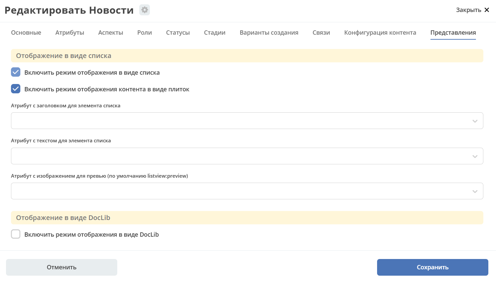

.. _datatypes_content:

Конфигурация контента и Представления
=======================================

Вкладка **«Конфигурация контента и Представления»** объединяет две группы настроек типа данных:

- **Конфигурация контента** — определяет, в каком атрибуте хранится основной файл объекта и где сохраняется контент.
- **Представления** — задаёт доступные режимы отображения объектов типа в журнале (список, плитки, библиотека документов).

Конфигурация контента
----------------------

Работа с контентом в Citeck осуществляется с использованием атрибутов типа данных с типом **"Содержимое"**.

Атрибут _content
~~~~~~~~~~~~~~~~~

Атрибут ``_content`` служит для доступа к основному контенту записи без необходимости узнавать в каком именно атрибуте
хранится контент. По умолчанию атрибут с контентом - content, но этот атрибут можно переопределить в типе во вкладке :guilabel:`Конфигурация контента`.

При загрузке нового контента в свойство ``_content`` имя содержимого записывается в свойство **name** сущности (если оно определено в атрибутах).

Контент в свойстве ``_content`` всегда имеет имя, которое совпадает с именем сущности (оно переопределяет имя самого контента).

Настройка типа
~~~~~~~~~~~~~~~

.. list-table::
      :widths: 10 30 30
      :header-rows: 1
      :align: center
      :class: tight-table

      * - п/п
        - Наименование
        - Описание
      * - 1
        - **Атрибут с основным контентом**
        - | атрибут, в котором находится контент, который доступен через свойство ``_content``.
          | Может быть сложным с указанием свойства из связанной сущности. Например - **linkedRecord.content**.
          | Если это поле оставить пустым, то основным полем с контентом будет **content**.

      * - 2
        - **Тип хранилища**
        - | хранилище, где будет сохраняться контент.
          | По умолчанию **"local"**, что в свою очередь означает, что контент будет сохраняться в БД в той же схеме, что и таблица сущностей создаваемого типа данных.
          | Подробно о :ref:`смене типа хранилища<type_content_storage>`.
      * - 3
        - **Атрибут с контентом для предпросмотра**
        - | атрибут, в котором находится контент, который будет использоваться для предпросмотра документа.
          | Если не указать значение, то используется **"Атрибут с основным контентом"**

Java
~~~~~

.. _EcosContentApi:

Для работы в java с контентом следует использовать интерфейс EcosContentApi:

Загрузка:

.. code-block:: java

  EntityRef tempFile = contentApi.uploadTempFile()
      .withMimeType("application/pdf")
      .writeContent((writer) -> writer.writeBytes(imageContent1));

  ObjectData attributeForMutation = ObjectData.create()
      .set("customContentAtt", tempFile);

  // Создание
  EntityRef newFileWithContent = recordsService.create("emodel/test", attributeForMutation);
  // Обновление
  recordsService.mutate(newFileWithContent, attributeForMutation);

Чтение:

.. code-block:: java

  EntityRef ref = EntityRef.valueOf("emodel/test@localId");
  EcosContentData contentData = contentApi.getContent(ref, "attributeWithContent");
  if (contentData == null) {
      throw new RuntimeException("Content is null");
  }
  // При работе с файлами, максимальный размер которых может быть более ~20мб
  // чтение контента в массив байт следует по возможности избегать. Иначе есть риск получить OutOfMemoryError
  byte[] bytes = contentData.readContent(reader -> {
      try {
          return IOUtils.toByteArray(reader);
      } catch (Exception e) {
          throw new RuntimeException(e);
      }
  });

.. _datatypes_views:

Представления
--------------

**Представления** определяют, в каком виде будут отображаться объекты типа данных в журнале. По умолчанию используется табличное представление; дополнительно можно включить режимы список, плитки или библиотека документов.

Настройка отображения данных в журнале:

Возможные варианты с примерами:

- :ref:`Список<publication>`. Режим можно использовать для представления списка новостей, базы знаний, перечисления товаров или оборудования. Выберите чекбокс:

.. list-table::
      :widths: 20 20
      :align: center

      * - |

            .. image:: _static/tab_views_2_1.png
                  :width: 500
                  :align: center

        - |

            .. image:: _static/tab_views_2.png
                  :width: 500
                  :align: center

- :ref:`Плитки<tiles>`. Режим можно использовать для представления списка новостей, базы знаний, перечисления товаров или оборудования. Выберите чекбокс:

.. list-table::
      :widths: 20 20
      :align: center

      * - |

            .. image:: _static/tab_views_3_1.png
                  :width: 500
                  :align: center

        - |

            .. image:: _static/tab_views_3.png
                  :width: 500
                  :align: center

- :ref:`Библиотека документов<document_library>`. Выберите чекбокс:

.. list-table::
      :widths: 20 20
      :align: center

      * - |

            .. image:: _static/tab_views_4_1.png
                  :width: 500
                  :align: center

        - |

            .. image:: _static/tab_views_4.png
                  :width: 500
                  :align: center

Список, плитки
~~~~~~~~~~~~~~~

Включение флагов **«Включить режим отображения в виде списка»** или **«Включить режим отображения контента в виде плиток»** добавляет поля для выбора:

- **Атрибут с заголовком для элемента списка**;
- **Атрибут с текстом для элемента списка**;
- **Атрибут с изображением для превью** (по умолчанию ``listview:preview``).

Система добавляет в тип данных аспект **listview**.

Настройки попадают в поле config этого аспекта (можно проверить в json). При этом на вкладке данный аспект не доступен и не виден.

Библиотека документов
~~~~~~~~~~~~~~~~~~~~~~

Включение флага **«Включить режим отображения в виде DocLib»** добавляет поле для выбора **«Тип для папок (по умолчанию "directory")»** . Настройка типа папок нужна, чтобы кастомизировать тип папок в библиотеке документов. Кастомный тип можно использовать для тонкой настройки прав или списка действий или других фич, которые можно настраивать через тип данных.

Система добавляет в тип данных аспект **doclib**. При этом на вкладке данный аспект не доступен и не виден.
