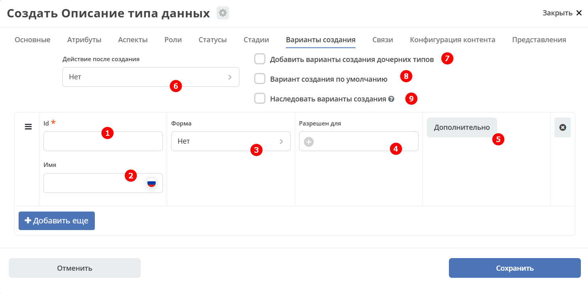
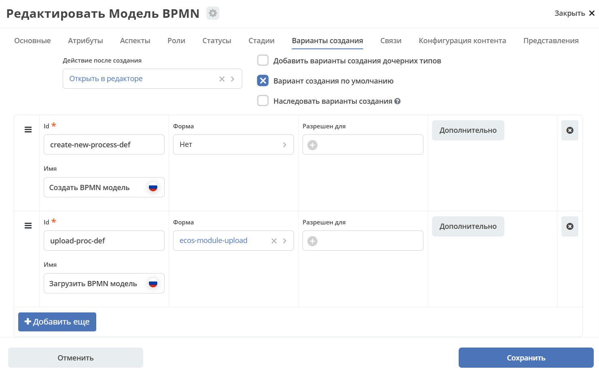
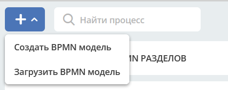
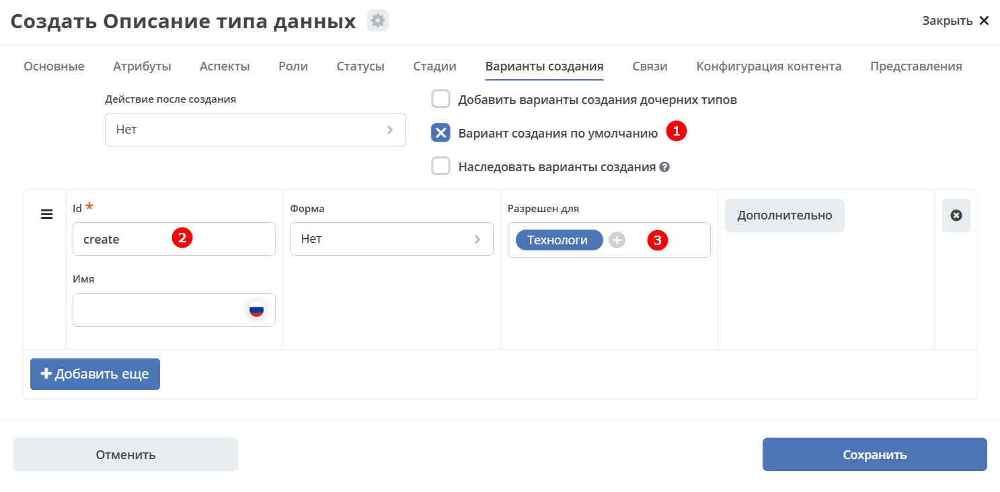

.. _create:

Варианты создания
==================

Настройка поддержки выбора варианта создания после выбора типа настраиваются на вкладке :guilabel:`Варианты создания`

.. list-table::
      :widths: 10 30 30 30
      :header-rows: 1
      :align: center
      :class: tight-table

      * - п/п
        - Наименование
        - Описание
        - Пример заполнения
      * - 1
        - **Id**
        - уникальный идентификатор варианта создания
        - testCreate (camel case)
      * - 2
        - **Имя**
        - имя поля для отображения пользователю.
        - Тестовый статус
      * - 3
        - **Форма**
        - выбор формы для варианта создания
        -
      * - 4
        - **Разрешен для**
        - пользователь или группа, для которых разрешен функционал.
        -
      * - 5
        - **Дополнительно**
        - дополнительные настройки.
        -
      * - 6
        - **Действие после создания**
        - | Возможность настроить действие после создания карточки.
          | Если ничего не выбрать, то по умолчанию будет открываться карточка записи.
          | Если выбрать **Действие отсутствует (none)**, то после создания карточки не будет перехода на карточку.
          | Данная настройка наследуется от родительского типа и для базового типа data-list из коробки установлено действие none.
        -
      * - 7
        - **Добавить варианты создания дочерних типов**
        - Нужно или нет в списке вариантов создания текущего типа отображать варианты создания дочерних типов
        -
      * - 8
        - **Вариант создания по умолчанию**
        - Нужно или нет автоматически сгенерировать вариант создания для типа
        -
      * - 9
        - **Наследовать варианты создания**
        - Добавить варианты создания из родительского типа к текущему. Если задано null, то значение флага наследуется от родительского типа.
        -

|

Ограничение прав на создание
------------------------------

Создание можно ограничить через настройку вариантов создания. **"+"** в журнале и пункт в меню **"Создать"** появляются только, если для пользователя есть доступные варианты создания.

В настройке типа можно отключить вариант создания по умолчанию и добавить новый с указанием групп, которые будут иметь к нему доступ. Заполнение имени и формы опционально. Если оставить эти поля пустыми, то они вычислятся автоматически.

