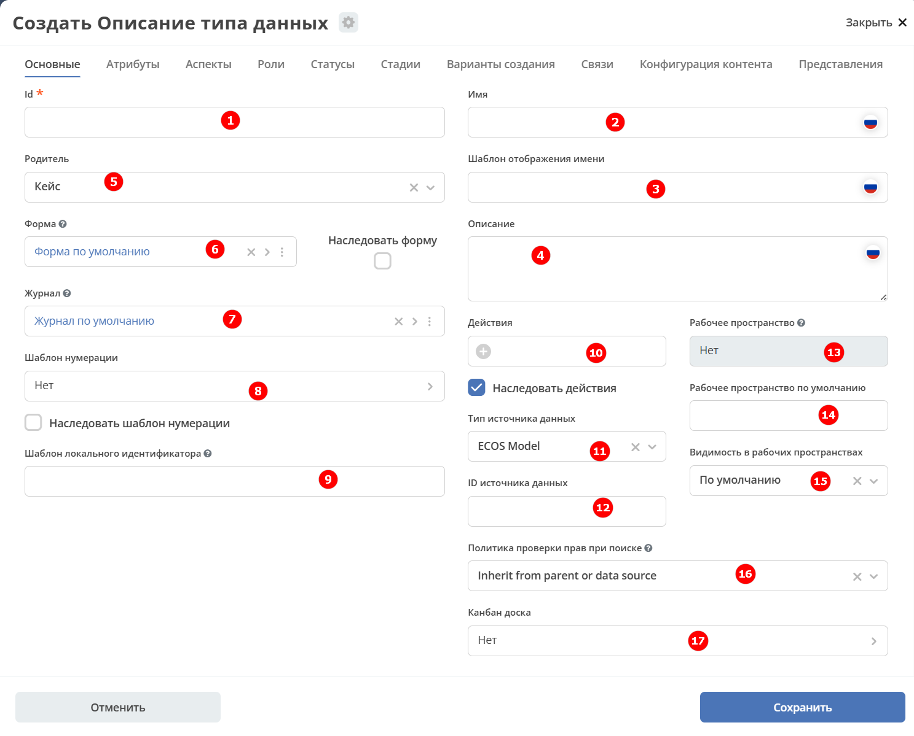
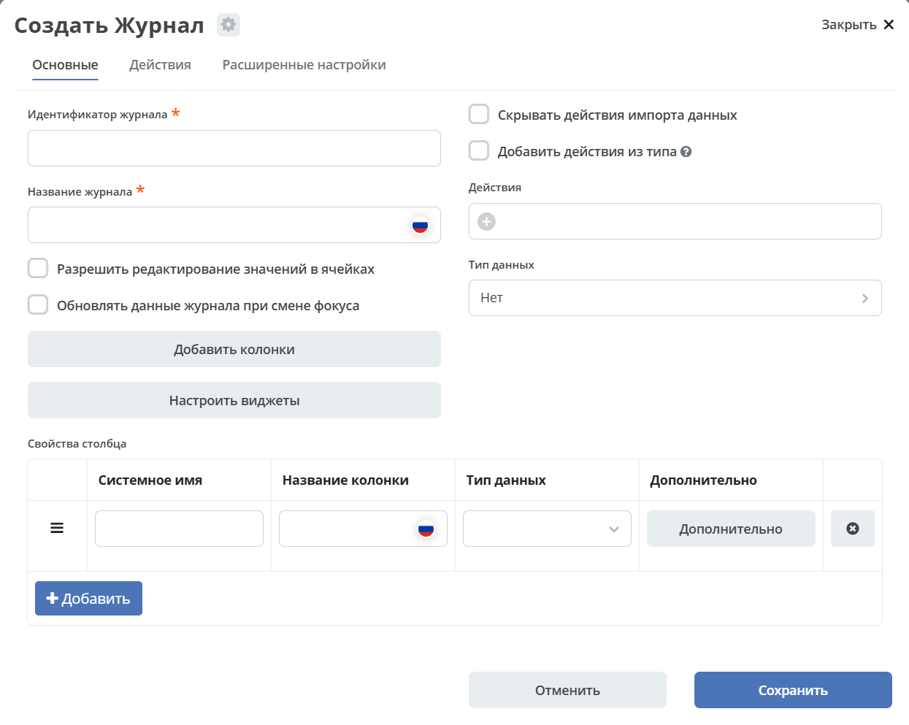
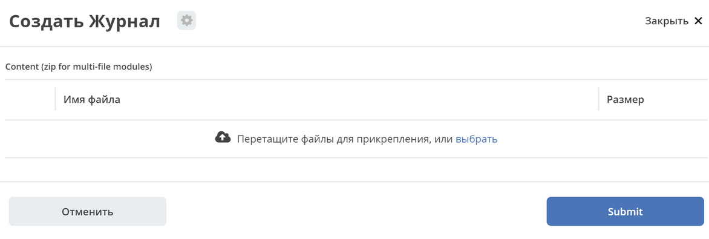
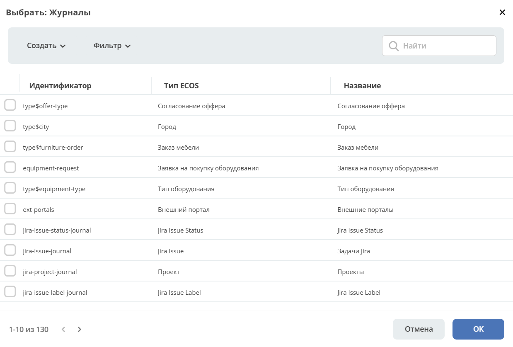

.. _data_types_main:

Основные
=========

Вкладка **«Основные»** — отправная точка при создании или редактировании типа данных. Здесь задаются ключевые параметры типа: идентификатор, название, родительский тип, связанные форма и журнал, хранилище данных, шаблон нумерации, доступные действия и настройки видимости в рабочих пространствах.

Поля **«Родитель»**, **«Форма»** и **«Журнал»** заполняются автоматически значениями по умолчанию и могут быть изменены вручную.

.. list-table::
      :widths: 10 30 30 30
      :header-rows: 1
      :align: center
      :class: tight-table

      * - п/п
        - Наименование
        - Описание
        - Пример заполнения
      * - 1
        - **Id (обязательное)**
        - уникальный идентификатор типа
        - test_type (snake case)
      * - 2
        - **Имя**
        - локализованное название компонента
        - Тестовый тип
      * - 3
        - **Шаблон отображения имени**
        - | локализованный шаблон заголовка записи, отображаемого при запросах ее локализованного имени (расширенный вариант для параметра п.2).
          | Поддерживает выражения с использованием данных записи
        - Тестовый тип № ${counter}
      * - 4
        - **Описание**
        - локализованное описание данного типа (необязательно).
        - Тип, используемый для тестовых целей
      * - 5
        - **Родитель**
        - тип данных, на основании которого, создается текущий.
        - | выбирается из списка предлагаемых:
          | :ref:`Кейс (по умолчанию), Справочник <data_types_types>`, Документ, Файл библиотеки документов, Публикация
          | Остальное – иные созданные ранее типы данных, на основе которых можно создать новый тип.
      * - 6
        - **Форма**
        - | ссылка на форму, которая будет открываться при инициировании создания записи данного типа.
          | Наследование формы позволяет не заполнять в дочернем типе поле **"форма"**, это поле в итоге заполнится значением из родительского типа.
        - есть вариант создания автоматически по умолчанию (Форма по умолчанию), создания вручную (Создать-Создать форму), загрузки (Создать-Загрузить форму).
      * - 7
        - **Журнал**
        - ссылка на журнал, который будет отображать записи данного типа
        - есть вариант создания автоматически по умолчанию (Журнал по умолчанию), создания вручную (Создать-Создать журнал), загрузки (Создать-Загрузить журнал).
      * - 8
        - **Шаблон нумерации**
        - | шаблон нумерации :ref:`См. Шаблоны нумерации<number_template>`
          | Возможно наследование шаблона нумерации от родительского или же наоборот его запрет (управляется проставлением соответствующего флага).
        - выбирается из списка предлагаемых
      * - 9
        - **Шаблон локального идентификатора**
        - | Задаёт правило генерации локальной части идентификатора (localId) в EntityRef, где общий вид ссылки: ``{appName}/{sourceId}@{localId}``.
          | Укажите шаблон с переменными, например: ``SD-${_docNum}``. 
          | Чтобы отключить шаблон, унаследованный от родительского типа, введите дефис: ``-``.
          | **Важно!** Изменение шаблона не влияет на уже созданные записи — их localId остаётся прежним. Чтобы обновить localId у существующих объектов в соответствии с новым шаблоном, воспользуйтесь функцией миграции в панели администратора.
        - 
      * - 10
        - **Действия**
        - | ссылки на действия, которые будут доступны в соответствующем виджете всех записей данного типа, а также в журнале, связанном с типом (:ref:`подробнее о действиях<ui_actions>`).
          | Возможно наследование действий от родительского или же наоборот его запрет (управляется проставлением соответствующего флага)
        - выбирается из списка предлагаемых
      * - 11
        - **Тип источника данных**
        - | хранилище, в которое будут заноситься записи данного типа (название отражает не используемую БД, а сервис, в БД которого будут направляться запросы).
          | Значение "По умолчанию" означает, что для места хранения будет использоваться "ID источника данных (12)" из текущего или родительского
          | типа и при этом не будет никакого автоматического создания хранилища. Т.е. при типе источника данных "По умолчанию" предполагается, что место хранения уже подготовлено заранее.
        - выбирается из списка предлагаемых.
      * - 12
        - **ID источника данных**
        - идентификатор источника для случая, когда используется хранилище не встроенное по умолчанию в систему (в случае когда в п.10 выбран вариант Custom).
        - test_datasource (snake case)
      * - 13
        - **Рабочее пространство**
        - | рабочее пространство, к которому относится данный тип. Если указано значение, тип считается "ограниченным" и может использоваться только внутри заданного рабочего пространства.
          | Если значение не задано, тип считается глобальным и доступен во всех рабочих пространствах.
        -
      * - 14
        - **Рабочее пространство по умолчанию**
        - в каком рабочем пространстве будет отображаться по умолчанию
        -
      * - 15
        - **Видимость в рабочих пространствах**
        - | -	**По умолчанию** – назначается типу данных по умолчанию.
          | - **Приватная** – экземпляры типа данных доступны в рамках рабочего пространства, в котором созданы.
          | - **Публичная** – экземпляры типа данных доступны пользователям в соответствии с правами, независимо от рабочего пространства, в котором созданы.
        -
      * - 16
        - **Политика проверки прав при поиске**
        - | позволяет настроить поиск с проверкой прав непосредственно записи, её родителя или вовсе отключить проверку прав при поиске.
          | В любом режиме результат поиска дополнительно проверяется на наличие доступа.
        -
      * - 17
        - **Канбан доска**
        - выбор канбан-доски :ref:`См. Канбан-доска<kanban_board>`
        -

Создание и редактирование журнала, формы из типа данных
---------------------------------------------------------

Прямо из карточки типа данных можно создать новый журнал или форму, загрузить их из файла, а также перейти к редактированию уже привязанного артефакта. Рассмотрим на примере журнала.

При нажатии на **"Создать-Создать журнал"** открывается форма создания журнала:

При нажатии на **"Создать-Загрузить журнал"** открывается форма загрузки журнала:

Функциональность реализована в настройках компонента :ref:`Select Journal во вкладке "Кастомные"<select_journal_component>`

При нажатии на **"Изменить"** открывается журнал, содержащий все созданные в системе журналы:

При нажатии на **Редактировать** открывается форма редактирования соответствующей выбранной сущности на новой вкладке.
