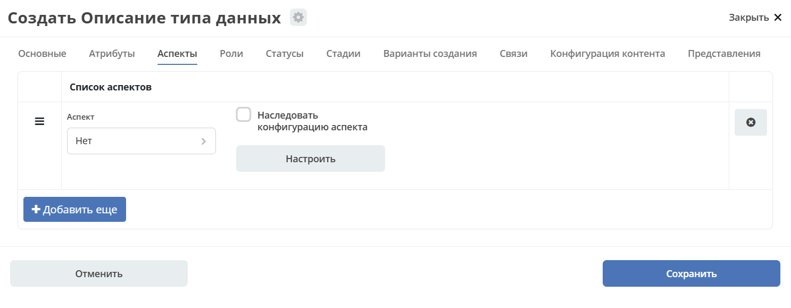
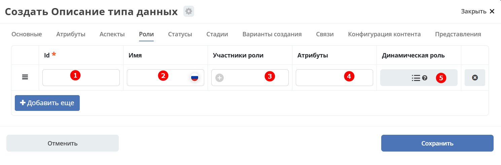
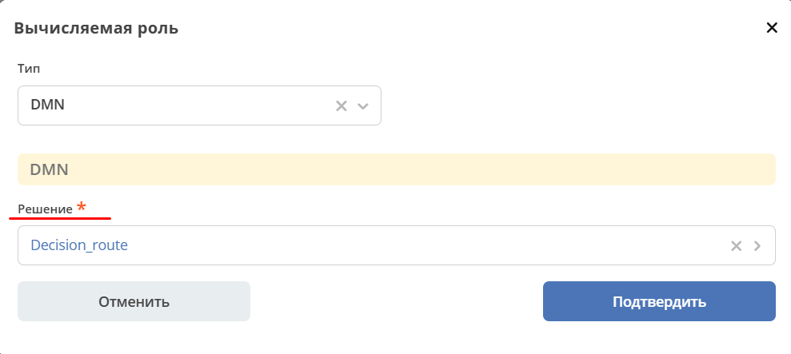
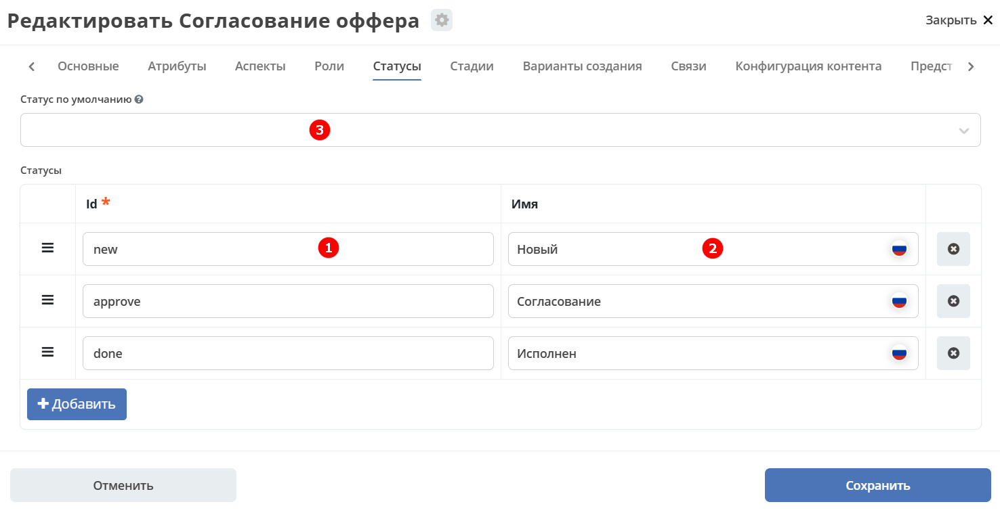
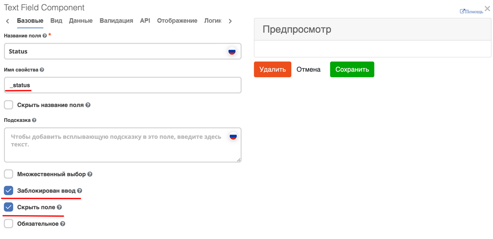
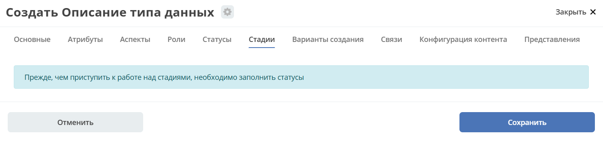
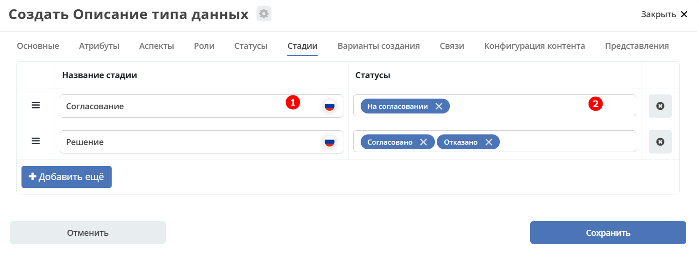

.. _data_types_roles_statuses:

Аспекты, Роли, Статусы, Стадии
================================

Вкладки **«Аспекты»**, **«Роли»**, **«Статусы»** и **«Стадии»** задают поведенческую и ролевую модель типа данных.

- **Аспекты** — готовые наборы атрибутов и логики, которые можно подключить к типу для расширения его функциональности.
- **Роли** — участники, связанные с объектами данного типа: используются для настройки прав доступа, назначения задач и отправки уведомлений.
- **Статусы** — состояния, через которые проходит объект в ходе своего жизненного цикла.
- **Стадии** — укрупнённые этапы жизненного цикла, каждый из которых объединяет один или несколько статусов.

.. _type_aspects:

Аспекты
--------

**Аспект** — это переиспользуемый модуль, добавляющий к типу данных готовый набор атрибутов и связанной логики. Подключив аспект, тип наследует все его атрибуты без необходимости описывать их вручную.

Выберите аспект из списка. По кнопке **«Настроить»** можно отредактировать конфигурацию — открывается форма, настроенная для :ref:`аспекта<aspects_user>`.

Атрибуты из добавленных аспектов будут доступны в создаваемом типе данных.

.. _roles_statuses:

Роли
-----

**Роль** определяет круг пользователей или групп, связанных с объектами данного типа. Роли используются в матрице прав доступа, при назначении задач в бизнес-процессах и для отправки уведомлений. Состав роли может быть задан статически (список участников) или вычисляться динамически на основе атрибутов объекта.

.. list-table::
      :widths: 10 30 30 30
      :header-rows: 1
      :align: center
      :class: tight-table

      * - п/п
        - Наименование
        - Описание
        - Пример заполнения
      * - 1
        - **Id**
        - уникальный идентификатор роли
        - myTestRole (camel case)
      * - 2
        - **Название логики**
        - имя роли
        - Тестовая роль
      * - 3
        - **Участники роли**
        - | статическое заполнение роли.
          | Выбор группы и/или отдельных пользователей из оргструктуры, которые будут выполнять функцию данной роли.
        - выбирается из списка оргструктуры организации
      * - 4
        - **Атрибуты**
        - динамическое заполнение роли. Выбор атрибута типа, на который будет ссылаться роль для получения назначаемых пользователей.
        - выбирается из списка предлагаемых атрибутов
      * - 5
        - **Динамическая роль**
        - | динамическое заполнение роли. Возможные варианты: Script, Attribute, Значение, DMN. См. :ref:`подробно<count_attributes>`
          | Установление произвольной гибкой логики, по которой будет произведено вычисление состава пользователей роли.
        - настройка конфигурации в зависимости от сложности и набора зависимых данных для вычисления состава роли

.. note::

  Если пользователь или группа есть в любом из трех полей **Участники роли, Атрибуты, Динамическая роль**, то считается что пользователь/группа является представителем роли. т.е. происходит объединение по **ИЛИ**.

Тип роли DMN
~~~~~~~~~~~~~

.. _dmn_role:

При выборе типа **DMN** необходимо выбрать опубликованное **Решение** из журнала.

.. _associations:

Статусы
--------

**Статус** отражает текущее состояние объекта в его жизненном цикле. Статусы используются в матрице прав, в бизнес-процессах для управления переходами, а также в интерфейсе для отображения на форме и в журнале.

.. list-table::
      :widths: 10 30 30 30
      :header-rows: 1
      :align: center
      :class: tight-table

      * - п/п
        - Наименование
        - Описание
        - Пример заполнения
      * - 1
        - **Id**
        - уникальный идентификатор статуса
        - testStatus (camel case)
      * - 2
        - **Название логики**
        - имя статуса
        - Тестовый статус
      * - 3
        - **Статус по умолчанию**
        - выбор статуса по умолчанию для типа, с которым будет создаваться объект.
        - | выбирается из списка предлагаемых. Например, черновик.
          | Частый кейс - использования функционала черновика, где bpmn процесс еще не запущен, но необходимо, чтобы рекорд имел какой-то начальный статус.

На форме документа статус может быть отражен следующим образом:

В компоненте :ref:`Text field <Text_Field>`:

- название поля может быть любым,
- имя свойства - **_status**,
- скрыть и заблокировать на ввод, если необходимо не отображать на форме.

.. _stages:

Стадии
-------

**Стадии** — этапы жизненного цикла документа. В каждую стадию входит один или несколько статусов.

Прежде, чем приступить к работе над стадиями, необходимо заполнить :ref:`Статусы<roles_statuses>`.

.. list-table::
      :widths: 10 30 30 30
      :header-rows: 1
      :align: center
      :class: tight-table

      * - п/п
        - Наименование
        - Описание
        - Пример заполнения
      * - 1
        - **Название стадии**
        - Наименование стадии
        - testStage (camel case)
      * - 2
        - **Статусы**
        - Перечень статусов, входящих в стадию
        - Выбирается из списка предлагаемых статусов

Каждый статус может быть назначен только на одну стадию:

Стадии отображаются в :ref:`виджете «Стадии»<widget_stages>`.
