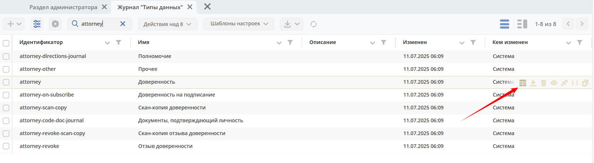
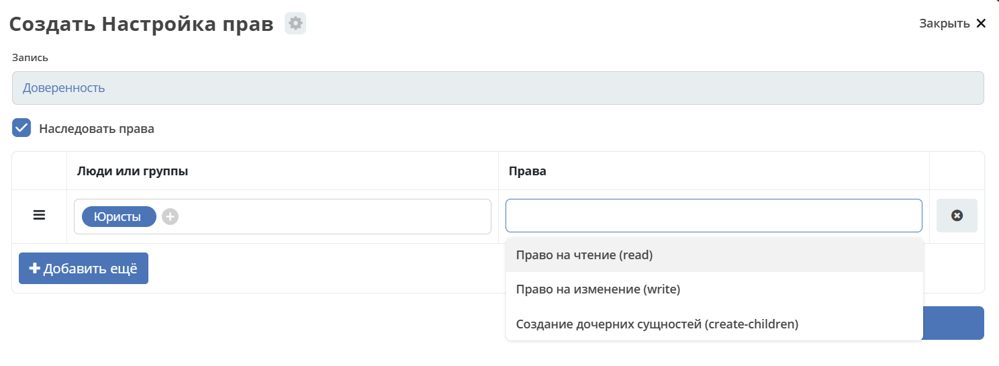

.. _data_type_rights:

Настройка прав для описания типов
===================================

В журнале типов для редактирования прав на конкретный тип доступна кнопка:

При нажатии на эту кнопку можно настроить права на конкретный тип:

Доступные права для редактирования:

.. list-table::
      :widths: 3 5
      :header-rows: 1
      :class: tight-table

      * - Идентификатор
        - Описание
      * - read
        - Право на чтение. На данный момент не проверяется т.к. конфигурации типов доступны всем.
      * - write
        - Право на изменение типа.
      * - create-children
        - Право на создание дочерних типов

Право на изменение типа имеют три категории пользователей:

  1. Системные администраторы
  2. Пользователи, которым выданы права write системным администратором
  3. Создатель типа

Наследование прав
------------------

Все права по умолчанию наследуются от родительского типа к дочерним, но это поведение можно отключить если убрать флаг **"Наследовать права"** при настройке прав на тип.

Право на создание типа без родителя
-------------------------------------

Если при создании типа поле с родительским типом оставить пустым, то родителем у такого типа будет тип с идентификатором **"base"**. Если нужно чтобы определенные пользователи могли создавать типы с любыми родителями, то следует выдать права **"create-children"** на тип **"base"**.
