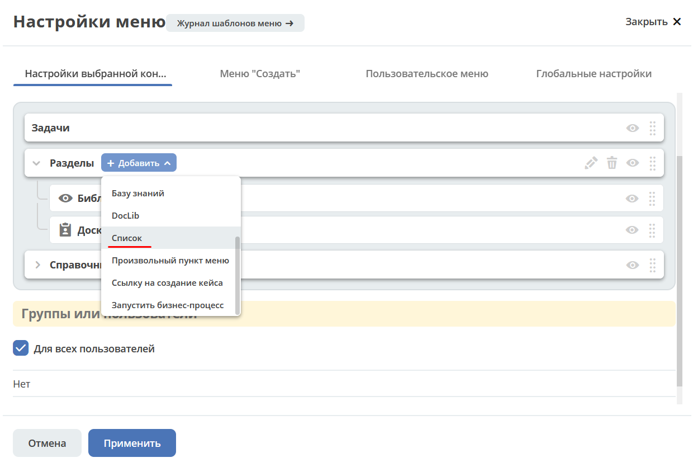
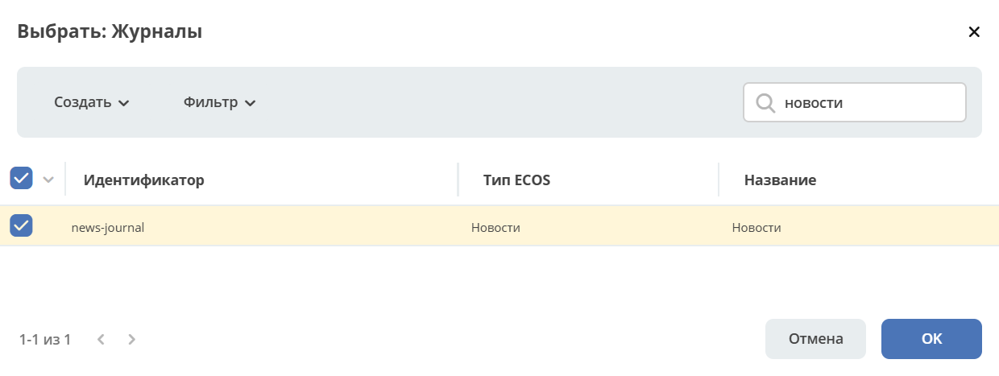
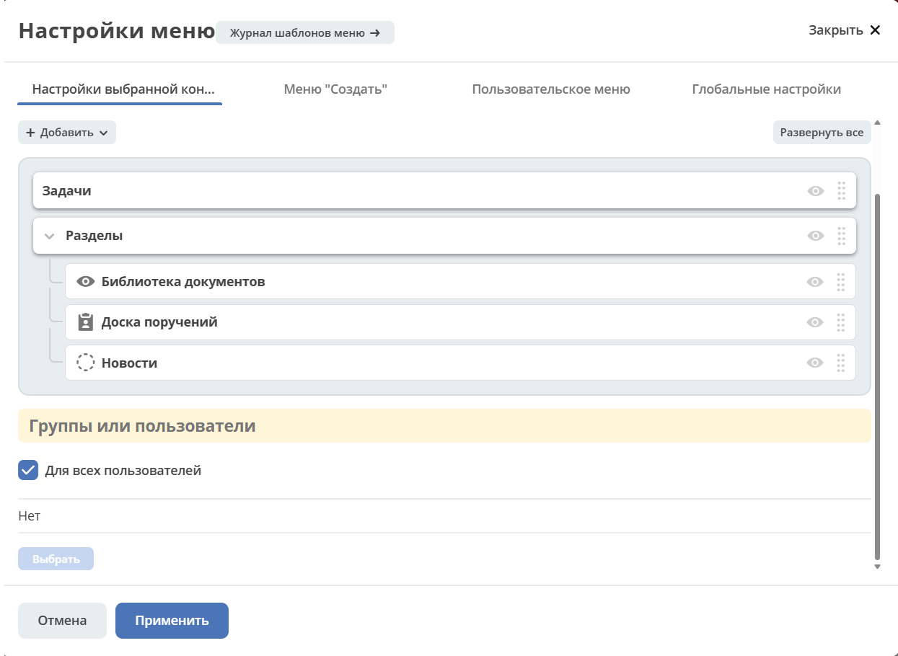
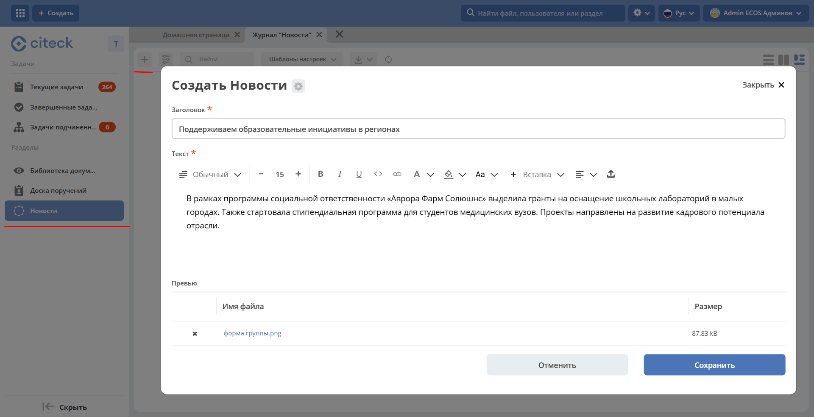

.. _news:

Новости
==============

**Журнал «Новости»** предназначен для публикации анонсов и новостей компании, которые отображаются сотрудникам непосредственно в рабочих пространствах через виджет :ref:`Новости <widget_news>`.

Журнал основан на типе данных :ref:`Публикация <publication>`. Для того чтобы новости отображались в виджете, необходимо добавить журнал **Новости** в меню нужного рабочего пространства, а затем создать публикации.

Добавление в меню рабочего пространства
--------------------------------------------------------------------------

Для добавления журнала **Новости** в меню рабочего пространства выберите специальный элемент **Список**:

Далее выберите журнал **Новости**:

Примените изменения:

Добавление публикаций
------------------------------------------

В журнале добавьте новости:

