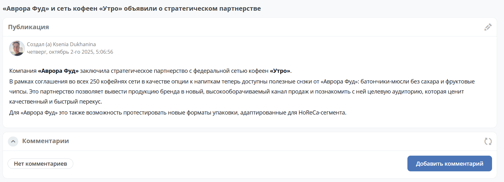
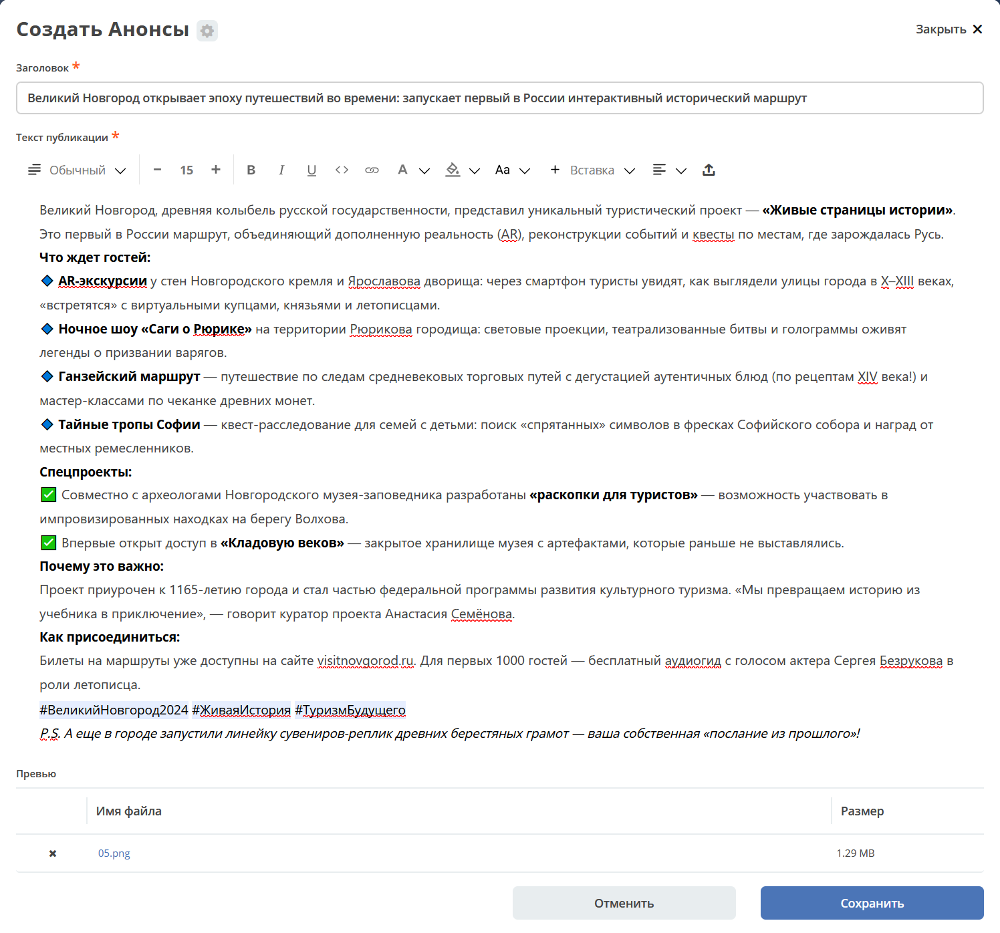
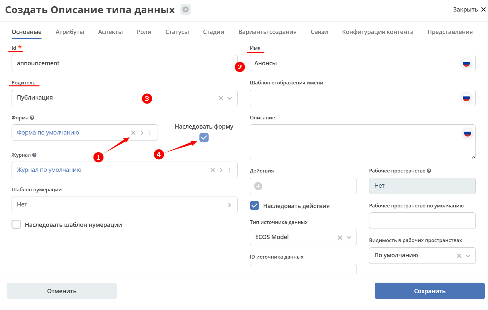
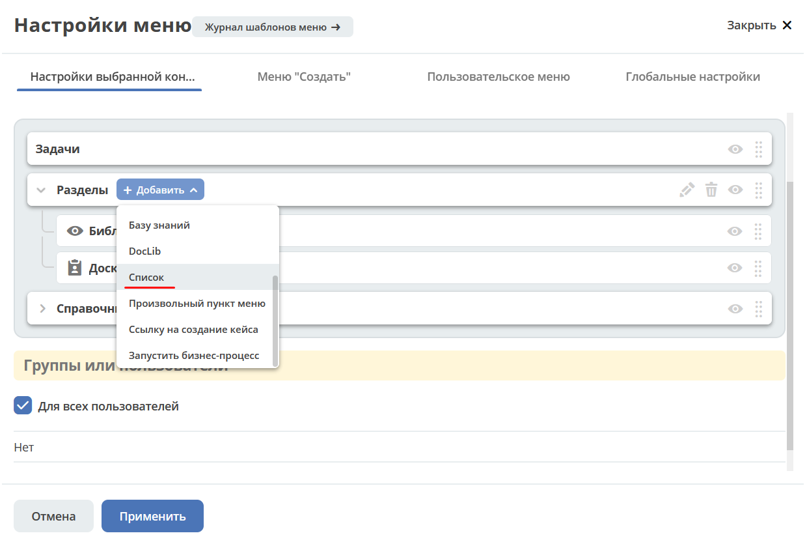

.. _publication:

Публикация
====================

.. contents::
   :depth: 3

**Публикация** — встроенный тип данных для создания новостей, анонсов и редакционных материалов, отображаемых в рабочих пространствах. На его основе строится журнал :ref:`Новости <news>`: статьи из него автоматически появляются в виджете :ref:`Новости <widget_news>`.

Тип предоставляет готовую форму с полями заголовка, текста и изображения-превью. Записи журнала отображаются в двух режимах — **список** и **плитка**.

- Список:

  .. image:: _static/publication/publication_03.png
     :width: 700
     :align: center

- Плитка:

  .. image:: _static/publication/publication_03_1.png
     :width: 700
     :align: center

По клику на превью или заголовок можно перейти к карточке. Карточка состоит из виджетов :ref:`Публикация <widget_publication>`, :ref:`Комментарии <widget_comments>`:

При создании публикации укажите **Заголовок**, напишите **Текст публикации**, добавьте изображение для превью. Для текста публикации доступен удобный :ref:`редактор контента <wysiwyg_editor>`.

.. _publication_creation:

Создание типа «Публикация»
--------------------------------------------------

Создайте новый :ref:`тип данных <data_types_main>`. Удалите **Форму по умолчанию** **(1)**, на вкладке **«Основное»** укажите **id**, **Имя** **(2)**, в качестве родителя выберите **Публикация** **(3)**, установите флажок **Наследовать форму** **(4)**.

В созданный тип будут автоматически добавлены действия и форма.

Для добавления публикации в меню выбирайте специальный элемент **Список**:

