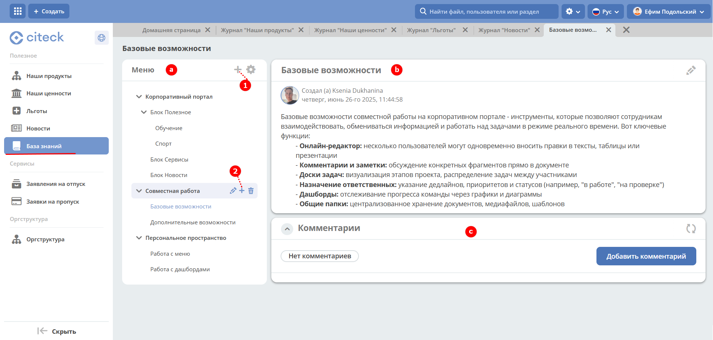
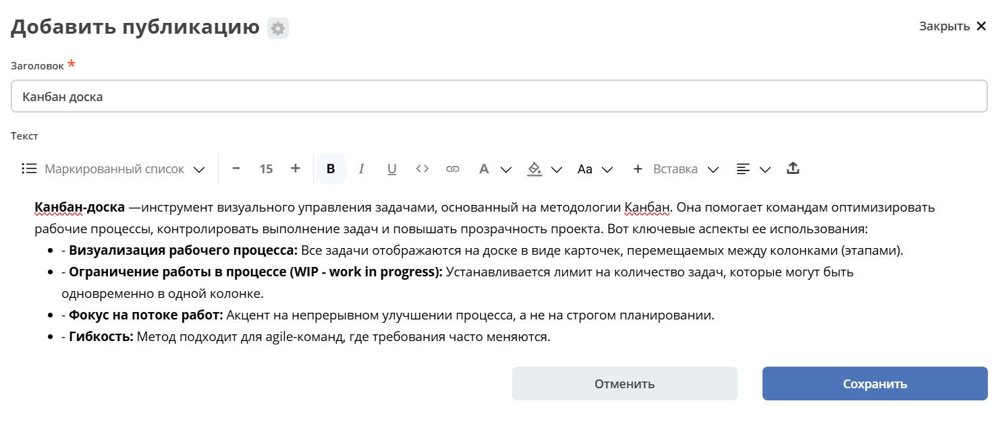
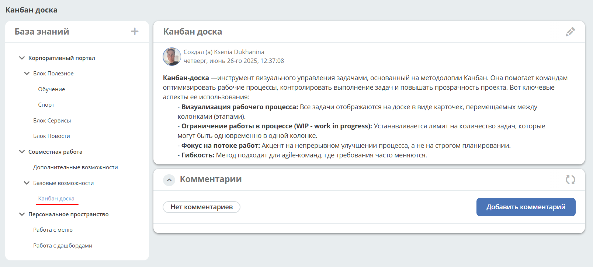
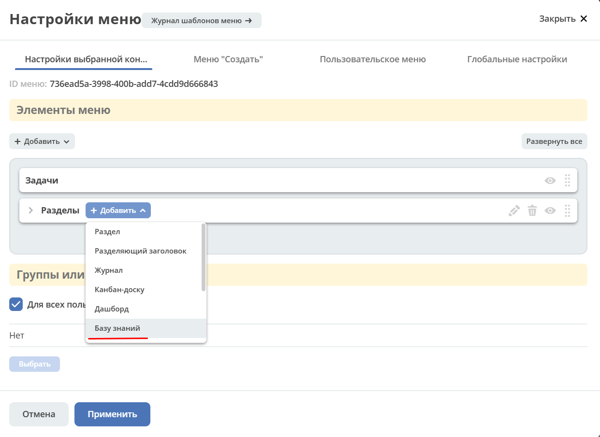
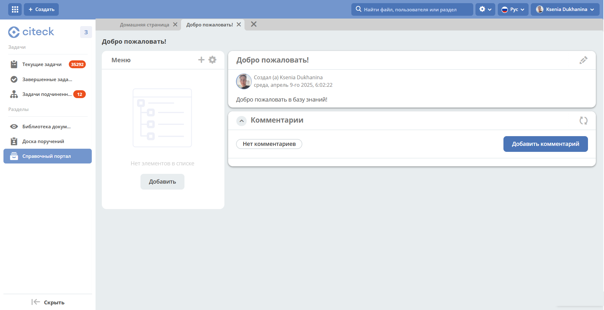

.. _wiki_base:

База знаний
========================

.. contents::
   :depth: 3

**База знаний** — встроенный тип журнала для создания и структурирования внутренней документации: регламентов, инструкций, статей и других материалов рабочего пространства. Контент организован в иерархическое дерево разделов с неограниченным уровнем вложенности; статьи доступны для совместного просмотра и комментирования.

.. note::

   В меню персонального рабочего пространства нельзя добавить базу знаний.

   Создание, редактирование, удаление публикаций доступно **администратору** и пользователю с ролью **«Менеджер»** рабочего пространства, в котором виджет размещён.

Перейдите в журнал **«База знаний»**:

База знаний состоит из трёх виджетов:

- **a:** :ref:`Меню <widget_knowledge_base>`,
- **b:** :ref:`Публикация <widget_publication>`,
- **c:** :ref:`Комментарии <widget_comments>`.

Для добавления статьи или раздела 1-го уровня нажмите большой **+** **(1)**, с использованием :ref:`редактора <wysiwyg_editor>` создайте контент, сохраните. Для добавления публикации или подраздела нажмите маленький **+** **(2)**. Количество создаваемых публикаций в каждом уровне не ограничено.

Созданная публикация становится активной и сразу отображается в правой части страницы.

Добавленная статья в структуре:

.. _wiki_adding:

Добавление базы знаний
--------------------------------------------

Для добавления базы знаний в меню выбирайте специальный элемент **База знаний**:

Укажите название и выберите иконку:

Создаётся пустая база знаний:

