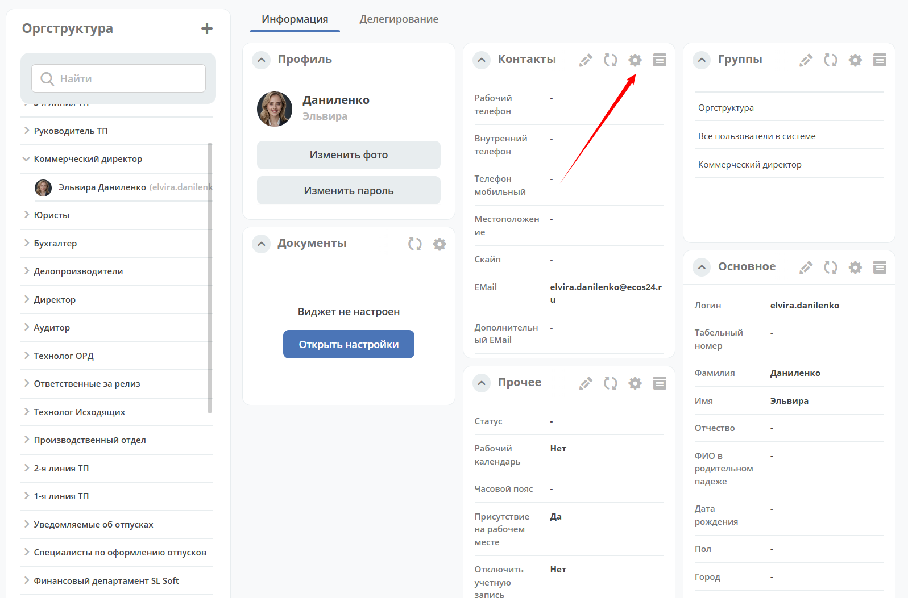

.. _widgets:

Виджеты
==========================

**Виджеты** — настраиваемые блоки информации, которые размещаются на :ref:`дашбордах <dashboard>` и отображают данные о документе, задачах, процессах, пользователях и другом контенте системы.

Виджеты добавляются и переносятся перетаскиванием при настройке дашборда. Набор доступных виджетов зависит от типа дашборда. Для части виджетов доступна индивидуальная настройка отображаемых данных.

.. _widget_settings:

Для некоторых виджетов доступна настройка. Настройка отмечена следующей иконкой:

.. note::

  При включенном конфиге **restrict-access-to-edit-dashboard-widgets** (true) настройка виджетов запрещена пользователю.

**Настройка прав на редактирование**

В системе для пользователей можно разграничить права на настройку дашборда (**restrict-access-to-edit-dashboard**) и настройку виджетов (**restrict-access-to-edit-dashboard-widgets**).

То есть у пользователя могут быть права на настройку дашборда, но запрещена настройка виджетов.

Конфиги хранятся в разделе **Управление системой – Конфигурация ECOS** (``v2/journals?journalId=ecos-configs&viewMode=table&ws=admin$workspace``):

.. image:: _static/widgets/dashboards_widgets_settings.png
       :width: 700
       :align: center

Включение настройки:

.. image:: _static/widgets/dashboards_widgets_settings_1.png
       :width: 400
       :align: center

.. toctree::
   :maxdepth: 3

   widgets/properties
   widgets/preview
   widgets/documents
   widgets/versions_journal
   widgets/doc_associations
   widgets/doc_status
   widgets/barcode
   widgets/current_tasks
   widgets/tasks
   widgets/record_actions
   widgets/stages
   widgets/process_statistics
   widgets/gantt
   widgets/comments
   widgets/activities
   widgets/events_history
   widgets/journal
   widgets/kanban
   widgets/graphic_statistics
   widgets/report
   widgets/news
   widgets/publication
   widgets/html
   widgets/web_page
   widgets/knowledge_base
   widgets/user_profile
   widgets/birthdays
   widgets/available_ws
