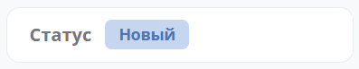
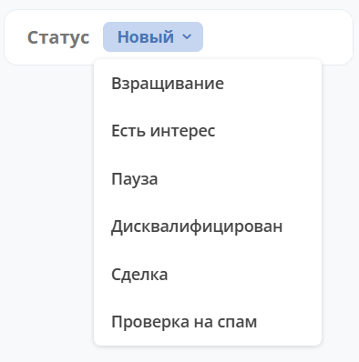

.. _widget_doc-status:

Виджет «Статус»
===============================================

Ключ ``doc-status``

Виджет отображает текущий статус кейса (определяется системой автоматически).

В настройках виджета можно включить опцию **«Разрешить изменение статуса»** (``allowChangeStatus``).

При включении в виджете появляется выпадающий список (шеврон) со всеми доступными статусами, что позволяет изменить статус напрямую из виджета.

Смена статуса выполняется без дополнительной логики (без проверок и валидаций, если иного не реализовано в бизнес-процессах на эвентах). Для смены статуса у пользователя должны быть права на редактирование записи.

